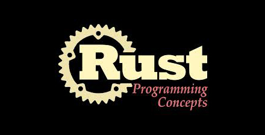

# 极客学院 Wiki Weekly Newsletter  
 
**(2015年8月2日~7日）**

  

## 首版前言

Wiki Weekly Newsletter 是极客学院 Wiki 团队根据网站内容提炼；格式简洁直白，图文并茂；每周五向读者推送本周最新课程、前沿技术和极客学院事件新闻的信息载体，主要内容包括：[精品课程](#name1)，[本周上线](#name2)、[课程预报](#name3)、[Wiki News](#name4) 四个板块。

## 精品课程

[《Oracle-RAC 体验》](http://wiki.jikexueyuan.com/project/oraclecluster/)（全名 “ LINUX 下基于 NFS 存储的 DATABASE 11G RAC 详细教程”）是一本介绍 Oracle RAC 原理与使用的教程，旨在帮助读者能够了解 Oracle 集群的原理，能够动手搭建集群，使用 Oracle Rac 技术解决问题。

[《Rust 语言中文版》](http://wiki.jikexueyuan.com/project/rust/) **国内首发** Rust 语言中文版。Rust 是 Mozilla 开发的注重安全、性能和并发性的编程语言。Rust 是针对多核体系提出的语言，并且吸收一些其他动态语言的重要特性，比如不需要管理内存，比如不会出现 Null 指针等。本书是官方文档的中文翻译版，内容不仅涉及入门级的基础知识点，也涉及 Rust 语言的高级用法，帮助读者了解这门系统编程语言。

[《禅与 Objective-C 编程艺术》](http://wiki.jikexueyuan.com/project/objc-zen-book/)
这本书的观点是代码不仅是可以编译的，同时应该是 “有效” 的。好的代码有一些特性：简明，自我解释，优秀的组织，良好的文档，良好的命名，优秀的设计以及可以被久经考验。 本书的一个理念是是代码的清晰性优先于性能，同时阐述为什么应该这么做。

[《Flask 用户指南》](http://wiki.jikexueyuan.com/project/flask-guide/)
Flask 是一个使用 Python 编写的轻量级 Web 应用框架。其 WSGI 工具箱采用 Werkzeug，模板引擎则使用 Jinja2。

[《Windows App 应用开发教程》](http://wiki.jikexueyuan.com/project/windowsappbook/)
随着微软的雄起，Windows 10 终于回到人们的视线。作为统一平台下的通用应用，它有一个更赞的名称为“Windows App”。

## 本周上线

- [Julia 中文手册](http://wiki.jikexueyuan.com/project/julia-manual/)

- [ASP.NET MVC 随想录](http://wiki.jikexueyuan.com/project/think-in-asp-net-mvc/)

- [Scrapy 中文指南](http://wiki.jikexueyuan.com/project/scrapy/)

- [Shell 十三问](http://wiki.jikexueyuan.com/project/13-questions-of-shell/)

- [Scala 二十四点游戏](http://wiki.jikexueyuan.com/project/scala-twentyfour-game/)

- [深入理解 Java 内存模型](http://wiki.jikexueyuan.com/project/java-memory-model/)

- [C 高阶教程](http://wiki.jikexueyuan.com/project/c-advance/)

- [C# 语言规范-基本概念篇](http://wiki.jikexueyuan.com/project/csharp-Language-specification-three/)

- [Cocos2D-x 从 C++ 到 JS 的进阶之路](http://wiki.jikexueyuan.com/project/cocos2d-x-from-cplusplus-js/)
 
- [简明 Python 教程](http://wiki.jikexueyuan.com/project/simple-python-course/)

- [坐在马桶上学算法](http://wiki.jikexueyuan.com/project/easy-learn-algorithm/)

- [Android RoboGuice 使用指南](http://wiki.jikexueyuan.com/project/android-roboguice/)

- [Docker 实践](http://wiki.jikexueyuan.com/project/docker-practice/)

- [Zend Framework 2 指南](http://wiki.jikexueyuan.com/project/zend2-user-guide/)

- [OpenResty 最佳实践](http://wiki.jikexueyuan.com/project/openresty-best-practice/)

## 课程预报

- 《ES6 深入理解》关于 ECMAScript 6 的深入分析，帮助读者全面系统的学习 ECMAScript 6 新标准。

- 《coffeeScript》是一门编译到 JavaScript 的小巧语言。在 Java 般笨拙的外表下，JavaScript 其实有着一颗华丽的心脏。CoffeeScript 尝试用简洁的方式展示 JavaScript 优秀的部分。

- 《Android 实战简易教程》一本能够快速上手的书，作者通过实战的几个例子，像读者展示如何快速开发 Android 应用。

- 《学习 GO 语言》一本值得深入学习的 GO 语言参考书。

- 《Harp 文档》Harp 是一个支持预处理的静态 Web 服务器，支持 Jade, Markdown, EJS, CoffeeScript,Sass,LESS 和 Stylus asHTML,CSS&JavaScript 的预处理，无需额外配置。特点是快速而且轻量级。

## Wiki News

### 内容套餐，不一样的学习体验

[《极客星球》](http://wiki.jikexueyuan.com/project/wiki-journal-201507-1/)：极客学院 Wiki 团队主编，旨在将国外最前沿的核心技术文章展示给读者；

[《The Swift Programming Language 中文版》](http://wiki.jikexueyuan.com/project/swift/)：国内最受欢迎的 Swift 学习版本，GitHub 好评 1W+ Star，每个 iOS 开发者必备的宝典；

[《Android Weekly 中文版》](http://wiki.jikexueyuan.com/project/android-weekly/)：Android Weekly 相当于是 Android 开发社区的实时通讯录，每周报导 Android 最新讯息，包括新的库、工具和博客等。

以上三个栏目是 Wiki 团队首推学习套餐，目前已在简书、程序员头条等平台发布内容，我们会保持更新，更多内容请移步：<http://wiki.jikexueyuan.com/>

### 极客学院 Wiki 团队招募简章

极客学院 Wiki 编辑团队招募活动正在进行中——高质量的课程内容是极客学院 Wiki 的核心与灵魂，而编辑团队正是这一核心的重要贡献者。我们希望编辑团队中的每一位同学在为 Wiki 贡献智慧、分享知识的同时，也能与极客学院 Wiki 一起共同成长。欢迎参与：<http://wiki.jikexueyuan.com/project/wiki-editors-guidelines/>

### 极客学院个人主页 V1.0 上线

极客学院个人主页 V1.0 主要包括个人信息、我的首页、学习的课程、最近访客等内容，方便个性化学习体验，也能看到其他小伙伴都在学习什么，增强人与人的互动，营造学习氛围，此外，我们还可以绑定个性化域名，想要体验的朋友赶快来注册吧。
<http://www.jikexueyuan.com/>

### 极客学院 Android 就业班第二期火热报名中

我们承诺：专业名师授课，小班开课，精心辅导，名师亲自点评作业，每周一次在线直播，灵活的学习进度，内部讲义，试学不满意全额退款，颁发证书+包就业。  
报名地址：<http://jiuye.jikexueyuan.com/train/android#nav07>。  
报名起止时间：2015-07-27——2015-08-23。

## 联系我们

QQ 群：323037186

Email：wiki@jikexueyuan.com

邮件订阅： <http://tinyletter.com/jikexueyuanwiki>

