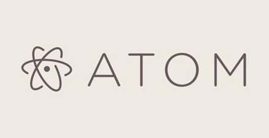

# 极客学院 Wiki Weekly Newsletter  
 
**(2015年9月20日~25日）**

 

## 精品课程

[《Go 笔记》第四版](http://wiki.jikexueyuan.com/project/the-go-study-notes-fourth-edition/)——作者雨痕通过自身学习 Go 语言总结而成，后续随着 Go 语言的更新，重新编写了几次版本，目前为最新版第四版。本笔记的优点是不仅仅是讲解语法，更多是思想方面的汇聚，所以不失为一部不错 Go 语言开荒手册。

[《Python 入门》（学习笔记）](http://wiki.jikexueyuan.com/project/the-python-study-notes-second-edition/)——内容分为四个部分：Python 语言、标准库、扩展库、附录。作者汇总 Python 语法精粹，在学习的过程中，总结并加入自身见解。想要了解这们“格式严格”的编程语言的魅力，那么本手册是一个不错的选择。也可以参看老齐[《零基础学 Python》(第二版)](http://wiki.jikexueyuan.com/project/start-learning-python/)。

[《Mac 开发配置手册》](http://wiki.jikexueyuan.com/project/mac-dev-setup/)——手册内容为「如何让一部全新的 MacBook 快速完成开发环境配置」，主要面向 Web 开发者。其中的指导，在 Mavericks 和 Yosemite 上有效，其他版本系统并未尝试。

[《21 分钟 MySQL 入门教程》](http://wiki.jikexueyuan.com/project/mysql/)——MySQL 目前是最流行的开源关系型 SQL 数据库管理系统，是一种用于最适于开发 Web 软件应用的 RDBMS。如果你现在还处于新手阶段，那么请来学习这个教程，简洁明了，重点知识点全部囊括，学完上手就做。

[《Atom 使用教程》](http://wiki.jikexueyuan.com/project/atom/)——Atom 是 Github 专门为程序员推出的一个跨平台文本编辑器。具有简洁和直观的图形用户界面，并有很多有趣的特点：支持CSS，HTML，JavaScript 等网页编程语言。它支持宏，自动完成分屏功能，集成了文件管理器。

## 本周上线

- [《Android Weekly 中文版 》171期](http://wiki.jikexueyuan.com/project/android-weekly/issue-170/index.html)

- [IntelliJ IDEA 使用教程](http://wiki.jikexueyuan.com/project/IntelliJ-IDEA-Tutorial/) 增加 Mac 安装章节。

## 课程预报

- 《Android Weekly 中文版 》171 期——每周报道 Android 最新讯息。

- 《The Swift Programming Language 中文版》——epub 修改版完成，下周你就可以下载到精美排版的后的 epub 文件，敬请期待。

## Wiki News

### React Native 中文版(含新增 Android 章节)

Facebook 于 2015 年 9 月 15 日发布了 React Native for Android， 把 Web 和原生平台的 JavaScript 开发技术扩展到了 Google 的流行移动平台--Android。

React Native For Android 的开源意味着 React 同时支持了各大主流平台。有了这套跨平台的 UI 工具包，开发者就可以用一套代码写出运行于 web、iOS 与 Android 之上的 UI（所谓的 learn once，write everywhere），其好处显而易见：减少了人力、节省了时间、避免了 iOS 与 Android 版本发布的时间差，开发新功能可以更迅速。

为了能让国内移动开发人员第一时间阅读 React Native for Android 最新官方文档，极客学院 Wiki 团队(wiki.jikexueyuan.com) 用不到一周的时间翻译完成了全部新增 Android 章节并与之前的 React Native中文版一起呈现给大家。

[绿色通道](http://wiki.jikexueyuan.com/project/react-native/)

## 联系我们

QQ 群：323037186

Email：wiki@jikexueyuan.com

邮件订阅： <http://tinyletter.com/jikexueyuanwiki>