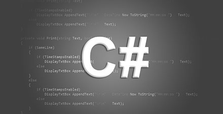
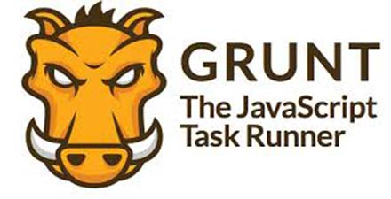

# 极客学院 Wiki Weekly Newsletter 
 
**(2015年12月6日~11日） 第 18 期**                                                 

 

## 精品课程

[《前端开发者手册》](http://wiki.jikexueyuan.com/project/fedHandlebook/)——《Front-end Developer Handbook》中文翻译版，作者 会飞的Pikachu 根据工作经验添加很多自己的个人见解，帮助读者更好得了解前端是什么、做什么、怎么做的问题。确实是一部**“适合任何人观看”**的前端百科全书。

[《Apache Ant 教程》](http://wiki.jikexueyuan.com/project/ant/)—Ant 是一个 Apache 基金会下的跨平台的基于 Java 语言开发的构件工具。本教程将以简单的方式会向你展示如何利用 Apache ANT 来自动地构建和部署过程。在完成本教程的学习以后，你将会发现你已经具备下一阶段学习 Apache Ant 中等水平的专业知识 。

[《Java 专题文章汇总》](http://wiki.jikexueyuan.com/project/java-special-topic/)——Java 专题采用在线协作模式进行内容填充的，主要内容涉及 J2SE 基础、Java Web 开发、Java 常用框架、Java 软件工程与设计模式、Java 操作系统、数据库和网络、Java 新技术、Java 数据结构和算法等几个大的分类。

[《C# 入门手册》](http://wiki.jikexueyuan.com/project/csharp/)——C# 是一门简单、先进、多用途的面向对象编程语言，它由微软 .NET 研究员 Anders Hejlsberg 和他的团队研发完成。本指南由浅入深的向读者讲解 C# 编程语言的基础及 C# 语言的高级使用。

[《Grunt 中文版》](http://wiki.jikexueyuan.com/project/grunt/)——Grunt是一个自动化的项目构建工具。 如果你需要重复的执行像压缩， 编译， 单元测试， 代码检查以及打包发布的任务。 那么你可以使用 Grunt 来处理这些任务， 你所需要做的只是配置好 Grunt， 这样能很大程度的简化你的工作。

## 本周上线

- [《Android Weekly 中文版 》182 期](http://wiki.jikexueyuan.com/project/android-weekly/issue-182/index.html)

- [《Gulp 入门指南》](http://wiki.jikexueyuan.com/project/gulp-book/)

- [《Atom 使用教程》](http://wiki.jikexueyuan.com/project/atom/)更新插件使用 10 章内容。

## 课程预报

- 《Android Weekly 中文版 》183 期——每周报道 Android 最新讯息，把握 Android 国内外现状。（翻译已经全部开源）

- 《Tensorflow 官方中文版》—— Google 第二代人工智能开源框架使用教程，下周二将会翻译完成并上线，敬请期待。

## Wiki News

### IT 职业技能图谱

IT 职业技能图谱是由极客学院Wiki(国内专业的IT图文课程库)发起，希望通过网络众筹模式，制定一套完善的职业技能知识体系。方便各领域开发人员梳理自己的技能框架，了解自身的现状，进而为自己的 IT 职业生涯做出更好的规划。

做这件事的意义：各大教育机构还未统一，标准各异，你将是职业技能标准的制定者之一。

详细信息请看这里：<https://github.com/jikexueyuanwiki/skillmap>

## 联系我们

QQ 群：323037186

Email：wiki@jikexueyuan.com

邮件订阅： <http://tinyletter.com/jikexueyuanwiki>

