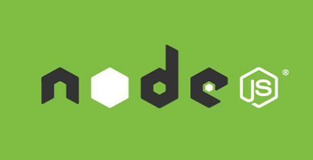

# 极客学院 Wiki Weekly Newsletter 
 
**(2015年11月15日~20日） 第 15 期**                                                 

 

## 精品课程

[《七天学会 Node.js》](http://wiki.jikexueyuan.com/project/nodejs-guide/)——Node.js 的是建立在 Chrome 的 JavaScript 的运行时，可方便地构建快速，可扩展的网络应用程序的平台。Node.js 使用事件驱动，非阻塞 I/O 模型，轻量、高效，可以完美地处理时时数据，运行在不同的设备上。从 Nodejs 官方网站的企业登记页，包括我们熟知的公司有 LinkedIn, Yahoo, Paypal, eBay, Walmart，Groupon 还有很多的中小型公司，国内的公司如雪球、淘宝、网易、百度等也都有很多项目运行在 Node.js 之上。本教程从代码、文件、网络、进程、异步及迭代等角度，详细讲解了 Node.js 在实际项目中是如何实现的。

[《Java 反射机制》](http://wiki.jikexueyuan.com/project/java-reflection/)——Java 反射机制功能强大而且非常实用。目前在互联网上已经有不胜枚举的 Java 反射指南，然而大多数的指南都仅仅只是介绍了一些反射的表面内容以及它的潜能。在这个系列的文章中，我们会比其他指南更深入的去理解 Java 反射机制，它会阐述 Java 反射机制的基本原理包括如何去使用数组，注解，泛型以及动态代理还有类的动态加载以及类的重载的实现。同时也会向你展示如何实现一些比较有特性的功能，比如从一个类中读取所有的 get/set 方法，或者访问一个类的私有变量以及私有方法。

[《CoffeeScript 实用手册》](http://wiki.jikexueyuan.com/project/coffeescript/)——CoffeeScript 是一门编译到 JavaScript 的小巧语言。在 Java 般笨拙的外表下，JavaScript 其实有着一颗华丽的心脏。CoffeeScript 尝试用简洁的方式展示 JavaScript 优秀的部分。本教程适合初学者一览 CoffeeScript 的小巧与内涵。

[《JUnit 入门教程》](http://wiki.jikexueyuan.com/project/junit/)——JUnit 是一个 Java 编程语言的单元测试框架。JUnit 在测试驱动的开发方面有很重要的发展，是起源于 JUnit 的一个统称为 xUnit 的单元测试框架之一。本教程将教你用 Java 编程语言做单元测试时，如何使用 JUnit。

[《C 语言教程中文版》](http://wiki.jikexueyuan.com/project/c/)——C 语言是一种广泛使用的计算机语言，它与 Java 编程语言一样普及，二者在现代软件程序员之间都得到广泛使用。本教程是专门为需要从零开始了解 C 语言的软件程序员打造的，让您对 C 语言有足够的认识，从而提升您自己的专业知识水平。

## 本周上线

- [《Android Weekly 中文版 》179 期](http://wiki.jikexueyuan.com/project/android-weekly/issue-179/index.html)

- [《从零开始学 Python》](http://wiki.jikexueyuan.com/project/start-learning-python/)

## 课程预报

- 《Android Weekly 中文版 》180 期——每周报道 Android 最新讯息，把握 Android 国内外现状。

- 《深入浅出Java Web》—— 此书为内容涉及 JSP、Servlet、SpringMVC 的详细展开讲解，是一部实实在在的 Java Web 进阶大餐。

- 《前端开发者手册》—— 零基础就能学习的前端手册，资深前端工程师经验汇总。

## Wiki News

### 『极客阅读周』读书送 Kindle

围绕极客 · Wiki，极客学院精心筹备了“极客阅读周”的活动！

一、免费阅读Wiki IT图文教程，写学习心得送Kindle电子书阅读器、优质IT图书。  
二、给Wiki产品&内容提建议，送小米插线板！

绿色通道：[点此进入](http://qun.jikexueyuan.com/wiki/topic/116?huodong=tieba_tiezi)

### TensorFlow 协同翻译进度汇报

2015年11月9日，Google 官方在其博客上称，Google Research 宣布推出第二代机器学习系统 TensorFlow。11月10日，极客学院做出积极响应，发起协同翻译项目，邀请人工智能领域的爱好者、专家一起参与进来。到目前为止， 所有章节认领完毕，翻译完成 18 章，校对认领 7 章，Star 数 365，fork 数 100，协同翻译 QQ 群及技术交流群的 TF 爱好者将近 300 人，GitHub 搜索 TensorFlow 排名第二。

Github 仓库地址：<https://github.com/jikexueyuanwiki/tensorflow-zh>

## 联系我们

QQ 群：323037186

Email：wiki@jikexueyuan.com

邮件订阅： <http://tinyletter.com/jikexueyuanwiki>

