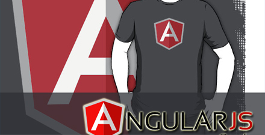
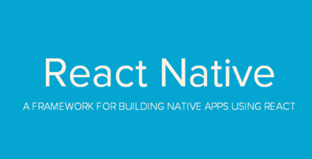
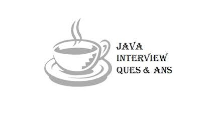
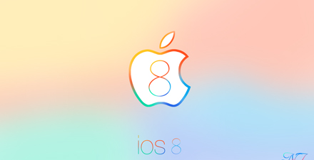
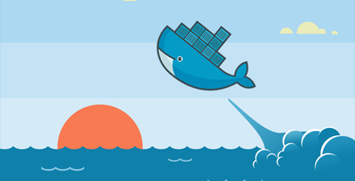

# 极客学院 Wiki Weekly Newsletter  
 
**(2015年8月30日~9月4日）**

 

## 精品课程

[《AngularJS 中文版》](http://wiki.jikexueyuan.com/project/angularjs-tutorial/)——本教程是官方文档翻译版，学习 AngularJS 的一个好方法是逐步完成本教程，它将引导您构建一个完整的 AngularJS Web 应用程序。该 Web 应用是一个 Android 设备清单的目录列表，您可以筛选列表以便查看您感兴趣的设备，然后查看设备的详细信息。

[《Facebook React Native 中文教程》](http://wiki.jikexueyuan.com/project/react-native/)——Facebook 在 React.js Conf 2015 大会上推出了基于 JavaScript 的开源框架 React Native，本教程翻译自 React Native 官方文档。

[《Java 面试宝典》](http://wiki.jikexueyuan.com/project/tomcat/)——本面试宝典的试题均来自于网上。我们按照 Java 知识点的分类整理出 17 章共 204 道笔试题，每道题都有解答，希望读者可以通过这些题目快速准备笔试面试并获得最终的求职成功。

[《iOS 8 人机交互指南》](http://wiki.jikexueyuan.com/project/ios-human-interface-guidelines/)——iOS 8 人机交互指南为 iPhoneHIG 的设计规范，旨在帮助交互设计师和应用开发者了解苹果应用设计规范，设计 iPhone 应用程序的用户界面，了解那些用于创建 iPhone 应用程序的用户界面的元素，同时还描述了各种可用的视图和控件并提供了如何有效使用它们的说明。

[《Docker 中文教程》](http://wiki.jikexueyuan.com/project/docker/)——Docker 是一款针对程序开发人员和系统管理员来开发、部署、运行应用的一款虚拟化平台。Docker 可以让你像使用集装箱一样快速的组合成应用、屏蔽代码层面的差异，会尽可能的缩短从代码测试到产品部署的时间。

## 本周上线

- [《D3.js 入门教程（连载）》](http://wiki.jikexueyuan.com/project/d3wiki/)

- [《Android 实战简易教程（连载）》](http://wiki.jikexueyuan.com/project/android-in-action/)

- [《现代 OpenGL 教程(连载）》](http://wiki.jikexueyuan.com/project/modern-opengl-tutorial/)

- [《Android Weekly 中文版 》168期](http://wiki.jikexueyuan.com/project/android-weekly/issue-168/index.html)

## 课程预报

- 《IntelliJ IDEA 简体中文专题教程》作者 [Judas.n](http://www.youmeek.com/) 唯一授权给极客学院发布，内容涵盖 IntelliJ IDEA 的安装、卸载、软件设置、项目配置等各个方面。通过本系列教程的学习，也希望你能爱上 IntelliJ IDEA，爱上它的体贴。

- 《Android Weekly 中文版 169 期》Android Weekly 相当于是 Android 开发社区的实时通讯录，每周报导 Android 最新讯息，下周将会更新至 169 期。

- 《Groovy 官方文档中文版》Groovy 是一种基于 JVM（Java 虚拟机）的敏捷开发语言，它结合了 Python、Ruby 和 Smalltalk 的许多强大的特性，本文档翻译自官方文档，版本 V2.4.4。

- 《Erlang 编程指南》很多年来，并发实时系统的编程技术一直落后于串行应用的编程，Erlang 这门专注于并发系统的新语言正是解决这个问题的关键，本指南将会系统的像读者展示这门语言的具体编写规则和实现原理。

## Wiki News

### Bootstrap 4 中文版已经来了！

Bootstrap 官方于 2015 年 8 月 19 日发布了其最新版本 Bootstrap v4.0.0-alpha。 Bootstrap 4 的开发是一项浩大的工程，将近一年的开发，几乎是对整个项目的重写，终于在 Bootstrap 四周岁生日的时候推出了最新的 v4-alpha 版本。

为了能让广大 Bootstrap 使用者以及国内众多 Web 开发人员第一时间同步阅读 Bootstrap 4 最新官方文档，极客学院 Wiki 团队(wiki.jikexueyuan.com) 用最短的时间一周内翻译完成了全部 v4.0.0-alpha 版本的文档，中国中文首发。

详细内容请移步：[boot4.com](http://boot4.com)

Bootstrap 3 最新修订版：[boot3.com](http://wiki.jikexueyuan.com/project/bootstrap/)

## 联系我们

QQ 群：323037186

Email：wiki@jikexueyuan.com

邮件订阅： <http://tinyletter.com/jikexueyuanwiki>

