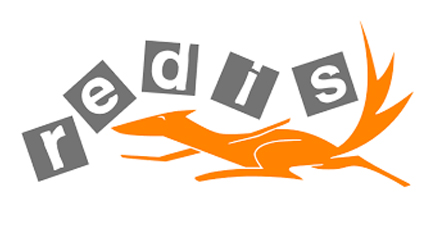

# 极客学院 Wiki Weekly Newsletter  
 
**(2015年8月23日~28日）**

  

## 精品课程

[《React 中文版》](http://wiki.jikexueyuan.com/project/react/)——React 是 Facebook 推出的一个用来构建用户界面的 JavaScript 库。具备以下特性：不是一个 MVC 框架、不使用模板、响应式更新非常简单、HTML5 仅仅是个开始。本书是一部非常全面的技术总结书籍，适各个阶段的读者参考学习。

[《Go 入门指南》](http://wiki.jikexueyuan.com/project/the-way-to-go/)——**《The Way to Go》**中文翻译版，作者 @无闻Unknwon 在阅读英文版后，有感于国内并没有比较好的 Go 语言书籍，而国外的优秀书籍因为英文的缘故在一定程度上也为不少 Go 语言爱好者带来了一些学习上的困扰，所以本着为了加快扩散 Go 爱好者的国内群体，在完成阅读这本名叫 《The Way to Go》 之后，决定每天抽出一点时间来进行翻译的工作，并且以开源的形式免费分享给有需要的 Go 语言爱好者。

[《Tomcat 8 权威指南》](http://wiki.jikexueyuan.com/project/tomcat/)——Tomcat 是由 Apache 软件基金会下属的 Jakarta 项目开发的一个 Servlet 容器，按照 Sun Microsystems 提供的技术规范开发出来。Tomcat 8 实现了对 Servlet 3.1 和 JavaServer Page 2.3（JSP）的支持，并提供了作为 Web 服务器的一些特有功能，如 Tomcat 管理和控制平台、安全域管理和 Tomcat 附加组件等。

[《MySQL 中文版》](http://wiki.jikexueyuan.com/project/mysql/)——本书为翻译国外经典教程 《Learn MySQL》一书，作为入门级读物，本书涵盖了 MySQL 学习过程要掌握的全部知识点，是一部非常不错的入门级参考书籍。

[《Redis 源码日志》](http://wiki.jikexueyuan.com/project/redis/)——极客学院第一位作者郑思愿的心血力作，作者对 Redis 这款  NoSQL 数据库做了详细的剖析，分析其内部代码的原理，是一部给力的 Redis 内功心法著作。

## 本周上线

- [《深入理解 Android 卷 II》](http://wiki.jikexueyuan.com/project/deep-android-v2/)

- [《GO 命令教程（连载）》](http://wiki.jikexueyuan.com/project/go-command-tutorial/)

- [《React 入门教程（连载）》](http://wiki.jikexueyuan.com/project/react-tutorial/)

- [《Learn Javascript（连载）》](http://wiki.jikexueyuan.com/project/learn-javascript/)

- [《单片机教程(三)》](http://wiki.jikexueyuan.com/project/mcu-tutorial-three/)

## 课程预报

- 《Java 专题系列-基础篇》极客学院 Wiki 团队根据 Java 学习路线图，制定符合 Java 程序员学习相关 Wiki 内容，将更加体现循序渐进的学习过程，旨在帮助读者更有效地掌握 Java 这们博大精深的开发语言。

- 《Android Weekly 中文版 168 期》Android Weekly 相当于是 Android 开发社区的实时通讯录，每周报导 Android 最新讯息，包括新的库、工具和博客等，只要你有 Email，就可以对其进行订阅，了解更多关于安卓的消息。

- 《深度解析 ECMAScript 6 》ECMAScript 6 简称 “ES6”，ES6 包含了很多新的语言功能，且这些语言功能使得 JavaScript 更加强大更富有表现力。后续会有三章更精彩的内容呈现。

- 《Chrome Dev Tools》Chrome 浏览器调试工具详解，目前国内还没有一部关于 Chrome ToolS 的教程，本教程是翻译国外最新官方使用手册，是一部值得前端工程师期待的调试宝典。

## Wiki News

### 极客学院诚聘兼职助教

极客学院兼职助教工作独具特色，总有一款适合你：

- 批改形式新颖：在线批改+视频点评，秒变技术达人
- 工作模式新潮：抢单批作业，难易随心选
- 时间地点灵活：在家 SOHO，玩耍赚钱两不误
- 轻松斩获高薪：每周参与 5 天，每月轻松赚部 iPhone 6
- 结识技术名人：极客学院金牌讲师伴你左右

>绿色通道：http://jiuye.jikexueyuan.com/assistant/apply

## 联系我们

QQ 群：323037186

Email：wiki@jikexueyuan.com

邮件订阅： <http://tinyletter.com/jikexueyuanwiki>