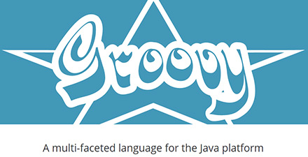

# 极客学院 Wiki Weekly Newsletter 
 
**(2015年11月8日~13日） 第 14 期**                                                 

 

## 精品课程

[《Laravel 5.1 中文版》](http://wiki.jikexueyuan.com/project/laravel-5.1/)——Laravel 于6月9日正式发布了 5.1 最新 LTS 版本。随着 Laravel 成为 PHP 领域最流行的框架，现推出为期三年的 long-time-support 版。改变：新的文档、支持 PSR-2、从 blade 模版中解析服务（service）、事件广播、更好的单元测试等。

[《Hadoop 教程》](http://wiki.jikexueyuan.com/project/hadoop/)——Hadoop 可运行于一般的商用服务器上，具有高容错、高可靠性、高扩展性等特点。本教程主要记录了 Hadoop 各个组件的基本原理，处理过程和关键的知识点等，包括 HDFS、YARN、MapReduce 等。

[《Groovy 入门》](http://wiki.jikexueyuan.com/project/groovy-introduction/)——Groovy 是用于 Java 虚拟机的一种敏捷的动态语言，它是一种成熟的面向对象编程语言，既可以用于面向对象编程，又可以用作纯粹的脚本语言。使用该种语言不必编写过多的代码，同时又具有闭包和动态语言中的其他特性。

[《jQuery 教程》](http://wiki.jikexueyuan.com/project/jquery-tutorial/)——jQuery 是开源软件，使用 MIT 许可证授权。jQuery 的语法设计使得许多操作变得容易，如操作文档对象（document）、选择 DOM 元素、创建动画效果、处理事件、以及开发 Ajax 程序。jQuery 也提供了给开发人员在其上创建插件的能力。这使开发人员可以对底层交互与动画、高级效果和高级主题化的组件进行抽象化。模块化的方式使 jQuery 函数库能够创建功能强大的动态网页以及网络应用程序。

[《Hexo 中文版》](http://wiki.jikexueyuan.com/project/hexo-document/)——Hexo 是一个快速、简洁且高效的博客框架。Hexo 使用 Markdown（或其他渲染引擎）解析文章，在几秒内，即可利用靓丽的主题生成静态网页。本教程会一步步引领，你只需按照教程的步骤，就可搭建并维护自己的博客。

## 本周上线

- [《Android Weekly 中文版 》178 期](http://wiki.jikexueyuan.com/project/android-weekly/issue-178/index.html)

- [《The Swift Programming Language 中文版》](http://wiki.jikexueyuan.com/project/swift/)修订图片，现在可以下载完整的 PDF 版。

## 课程预报

- 《Android Weekly 中文版 》179 期——每周报道 Android 最新讯息，把握 Android 国内外现状。

- 《Python Cookbook》3rd Edition——此书为 Python 3 的普及做了突出贡献，现特整理成简洁的 Wiki 版供大家学习使用。

## Wiki News

### 极客学院 Wiki 宣传页上线

属于 Wiki 自己的简洁——我们的宣传页于11月11日正式上线，期间搜集了 10 位原创作者的信息供大家了解，推荐国内首发课程，极客自创书籍上线亚马逊、多看等平台的作品展示，如此种种，最关键的是，11月16日，看 Wiki 将会有 Kindle 相送。

绿色通道：[点此进入](http://e.jikexueyuan.com/wikiweek.html?huodong=wikiweek_shouye_banner_1111)

### 极客牵头，你来参与，体验国内首发的快感

2015年11月9日，Google 官方在其博客上称，Google Research 宣布推出第二代机器学习系统 TensorFlow，针对先前的 DistBelief 的短板有了各方面的加强，更重要的是，它是开源的，任何人都可以用。11月10日，极客学院做出相应，发起协同翻译项目，让人工智能领域的爱好者、专家们一起参与进来，以最短的时间，整理出中文版的教程，帮助大家了解未来的主流技术——人工智能。

Github 仓库地址：<https://github.com/jikexueyuanwiki/tensorflow-zh>

## 联系我们

QQ 群：323037186

Email：wiki@jikexueyuan.com

邮件订阅： <http://tinyletter.com/jikexueyuanwiki>

