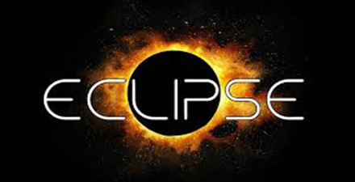

# 极客学院 Wiki Weekly Newsletter  
 
**(2015年10月4日~9日）**

 

## 精品课程

[《Gradle User Guide 中文版》](http://wiki.jikexueyuan.com/project/GradleUserGuide-Wiki/)——Gradle 用户指南官方文档中文版，作者 DONGChuan 及其团队授权极客学院发布，正如 Gradle 处于开发完善阶段，本文档也随着官方英文版的更新实时维护。

[《Android 开源项目指南》](http://wiki.jikexueyuan.com/project/android-source/)——Android 开源项目是针对各种各样具有不同外形的设备创建的开源软件栈。它的主要目的是为运营商、原始设备制造商（OEMs）和开发人员创造一个开放的软件平台。

[《Android OpenGL ES 开发教程》](http://wiki.jikexueyuan.com/project/opengl-es-guide/)——OpenGL ES 主要用来开发 3D 图形应用的。OpenGL ES (OpenGL for Embedded Systems) 是 OpenGL 三维图形 API 的子集，针对手机、PDA 和游戏主机等嵌入式设备而设计。本教程结合实例由浅入深地讲解了使用 OpenGL ES 进行 3D 图形开发的。

[《Django 搭建简易博客教程》](http://wiki.jikexueyuan.com/project/django-set-up-blog/)——搭建个人博客不再是困难的事，本教程突出以教促学的观点，循序渐进的带你搭建个人博客，源码在 Github 上就能获取，尝试从这里开始。

[《Eclipse 使用教程》](http://wiki.jikexueyuan.com/project/eclipse/)——Eclipse 是 Java 的集成开发环境（IDE），当然 Eclipse 也可以作为其他开发语言的集成开发环境，如C，C++，PHP，和 Ruby 等。这是一部非常详细的 Eclipse 入门经典教程，为你的开发之旅保驾护航。

## 本周上线

- [《Android Weekly 中文版 》172期](http://wiki.jikexueyuan.com/project/android-weekly/issue-172/index.html)

- [《Android Weekly 中文版 》173期](http://wiki.jikexueyuan.com/project/android-weekly/issue-173/index.html)

- [《D3.js 入门教程》](http://wiki.jikexueyuan.com/project/d3wiki/) 新增七章。

## 课程预报

- 《Android Weekly 中文版 》174 期——每周报道 Android 最新讯息。

- 《Android&Java 学习笔记》——作者 Piasy Xu 工作总结，绝对干货，突出解决实际问题和经验汇总，敬请期待。

- 《Material Design 中文版》——为了更好的阅读体验，接受读者修改意见，对本书进行二次校对，校对后的内容能够完整生成 PDF、EPUB 离线下载。

## Wiki News

### 极客学院免费视频汇总

既 Wiki 免费开放后，极客学院为感谢新老同学，特此开放部分免费视频，为了使学习更高效，我们特做内容整合，现已经有 9 大分类，100+ 视频课程供大家学习参考。

想要了解的同学请点击：[绿色通道](http://www.jikexueyuan.com/blog/449.html?huodong=freecourse_shouye_banner_0909)

## 联系我们

QQ 群：323037186

Email：wiki@jikexueyuan.com

邮件订阅： <http://tinyletter.com/jikexueyuanwiki>