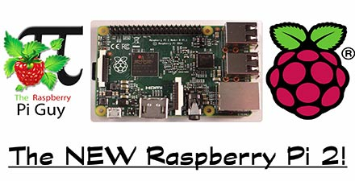
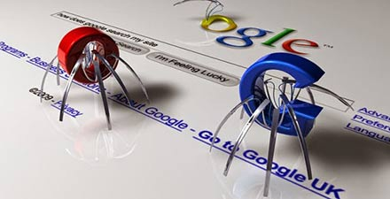

# 极客学院 Wiki Weekly Newsletter 
 
**(2015年12月13日~18日） 第 19 期**                                                 

 

## 精品课程

[《TensorFlow 官方文档中文版》](http://wiki.jikexueyuan.com/project/tensorflow-zh/)——极客学院 Wiki 组织翻译，40位专业人士合译，500名爱好者参与发起。国内第一部机器学习开源教程。历时 1 个月时间，呈现给大家，作为 Google 第二代机器学习系统，它将是人工智能工业化的开始，跟上潮流，从这里开始。

[《WebGL 中文版》](http://wiki.jikexueyuan.com/project/webgl/)—WebGL 是一种 3D 绘图标准，这种绘图技术标准允许把 JavaScript 和 OpenGL ES 2.0 结合在一起，通过增加 OpenGL ES 2.0 的一个 JavaScript 绑定，WebGL 可以为 HTML5 Canvas 提供硬件 3D 加速渲染，这样 Web 开发人员就可以借助系统显卡来在浏览器里更流畅地展示3D场景和模型了，还能创建复杂的导航和数据视觉化。本教程是 WebGL 的最新版介绍，文章区别于网上其他同类的内容，内容全面且新颖，旨在通过简洁的介绍，让读者明白 WebGL 是如何使用的。

[《Raspberry pi 一个好玩的派》](http://wiki.jikexueyuan.com/project/raspberry-pi-funny/)——“麻雀虽小，五脏俱全”，这句话形容树莓派是再合适不过了，只有信用卡大小的卡片式电脑，内部装有 Linux 操作系统，你可用它看电影，打游戏，做 Wifi 热点，还可以用于智能家居。自问世以来，受众多计算机发烧友和创客的追捧，曾经一“派”难求。本文从组装，系统，应用，实际开发等角度，由浅入深的介绍了树莓派这个有意思的派。

[《Go Web 编程》](http://wiki.jikexueyuan.com/project/go-web-programming/)——本文介绍如何用go语言进行web应用的开发，将go语言的特性与web开发实战组合到一起，帮读者成功地构建跨平台的应用程序，节省go语言开发web的宝贵时间。

[《Python 网络爬虫实战》](http://wiki.jikexueyuan.com/project/python-crawler/)——为什么用 Python 写网络爬虫？Python 这种稍严谨而流行库又非常多的语言, 大大弱化了计算机运行速度对程序的影响, 强化了为程序员容易思考而打造的特性，所以选择 Python 来实现网络爬虫。本教程简单的介绍如何使用 Python 的相关模块如 urllib2 来实现网络爬虫，还有百度贴吧和糗事百科的抓取例子供大家学习参考。

## 本周上线

- [《Android Weekly 中文版 》183 期](http://wiki.jikexueyuan.com/project/android-weekly/issue-183/index.html)

- [《PM 周刊》](http://wiki.jikexueyuan.com/project/pmweekly/) 优质产品经理文章汇总，以后每周定期更新。

## 课程预报

- 《Android Weekly 中文版 》184 期——每周报道 Android 最新讯息，把握 Android 国内外现状。

- 《PM 周刊》第 10 期—— 产品经理界最实用干货，开拓的不仅仅是视野。

## Wiki News

### Wiki 2.0 首页改版

为了加大信息密度，营造良好的内容展现，Wiki 在用户提议的基础上做了一次版本迭代，上线后的界面简洁、重点突出并增加了如下新功能：

- 热门排行榜
- Wiki贡献者展示
- 原创作者投稿
- 合作伙伴展示
- 推荐课程轮播展示

详细信息请看这里：<http://wiki.jikexueyuan.com/>

## 联系我们

QQ 群：323037186

Email：wiki@jikexueyuan.com

邮件订阅： <http://tinyletter.com/jikexueyuanwiki>

