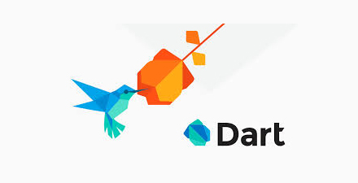
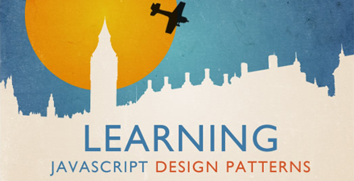

# 极客学院 Wiki Weekly Newsletter  
 
**(2015年9月13日~18日）**

 

## 精品课程

[《IntelliJ IDEA 使用教程》](http://wiki.jikexueyuan.com/project/IntelliJ-IDEA-Tutorial/)——极客学院签约布道师张朝煌老师原创，介绍当今开发平台领域的重要工具之一 IntelliJ IDEA，本教程图文并茂，详细的讲解了开发过程中需要的实用知识点，帮助读者打造自己的开发利器。

[《Java 课程 COOL》](http://wiki.jikexueyuan.com/project/java-course/)——史上最实用的 Java 教程汇总，有导读，有技术分析，有重点知识推荐，涵盖 J2SE，Java Web，常用框架，数据库网络，构建工具等。

[《Dart 编码风格指南》](http://wiki.jikexueyuan.com/project/dart-style-guide/)——当我们构建好了 Dart 编码系统时，使用一致的编码风格是很重要的。本教程是精心编写的 Dart 风格指南，旨在帮助大家了解该语言独有的特性，并且让 Dart 开发者之间的协作更加容易。

[《HomeKit 开发指南》](http://wiki.jikexueyuan.com/project/homekit/)——本文档主要帮助家庭自动化配件的开发者来进行 HomeKit App 的开发，帮助读者了解智能家居平台 HomeKit，并了解智能家居控制的原理。

[《App Store 上线的那些事儿》](http://wiki.jikexueyuan.com/project/app-store-refused/)——本教程是结合极客学院 iOS 组多次被拒后经验的总结而成，通过他们的经验，将那些上线标准没有明确说明，但是审核人会以此为理由拒绝的“潜规则”列举出来。总结了上线前需要注意的地方和自检方法，帮助 App 应用开发者顺利上线。

## 本周上线

- [《从头到尾彻底理解 KMP》](http://wiki.jikexueyuan.com/project/kmp-algorithm/)

- [《Android Weekly 中文版 》170期](http://wiki.jikexueyuan.com/project/android-weekly/issue-170/index.html)

## 课程预报

- 《Android Weekly 中文版 》170 期——每周报道 Android 最新讯息。

- 《GO 学习笔记》——作者 [雨痕](https://github.com/qyuhen) 个人学习总结，适合 GO 新手参考学习，目前已经发布第四版。

## Wiki News

### 极客学院代理招募令

海纳百川，有容乃大。极客学院本着互利共赢，让更多人可以享受到高质量的技术课程的原则，开始招募企业和校园代理。只要你有资源，你有心与人分享，那么你就能被人们知道。

[绿色通道](http://www.jikexueyuan.com/blog/503.html?huodong=daili_shouye_banner_0917)

### BootStrap 4 中文版极客版

极客学院组织翻译并整理 Bootstrap 4，目前 Bootstrap 4 处于持续更新版本修订状态，为了满足广大用户的需求，我们特约资深前端开发工程师[樊潇洁](http://weibo.com/u/5596869470)定时为其更新，保证内容最新最好最快的展示给读者，同时我们也欢迎更多的前端爱好者参与进来，共同维护这个项目。

[绿色通道](http://wiki.jikexueyuan.com/project/bootstrap4/getting-started/introduction/)

## 联系我们

QQ 群：323037186

Email：wiki@jikexueyuan.com

邮件订阅： <http://tinyletter.com/jikexueyuanwiki>