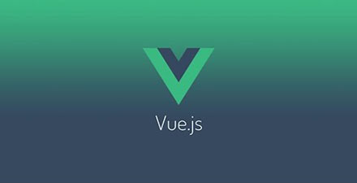
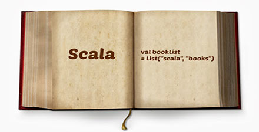

# 极客学院 Wiki Weekly Newsletter 
 
**(2015年11月29日~12月4日） 第 17 期**                                                 

 

## 精品课程

[《Android官方培训课程中文版(v0.9.4)》](http://wiki.jikexueyuan.com/project/android-training-geek/)——Google Android 团队在 2012 年的时候开设了 Android Training 板块，这些课程是学习 Android 的绝佳资料。本课程是作者胡凯发起组织翻译，由广大 Android 爱好者全力打造的史上最好的 Android 学习指南，现在由极客学院 Wiki 小组整理，欢迎大家学习指导。

[《坐在马桶上学算法》](http://wiki.jikexueyuan.com/project/easy-learn-algorithm/)—在各种算法流行的今天，小编为大家汇总了坐在马桶上看算法系列文章，图文并茂，风趣易懂，每天一算法让你轻松走进算法的世界，欢迎大家来学习。

[《Linux 命令行》](http://wiki.jikexueyuan.com/project/linux-command/)——这本书介绍如何生存在 Linux 命令行的世界。不像一些书籍仅仅涉及一个程序，比如像 shell 程序，bash。 这本书将试着向你传授如何与命令行界面友好相处。 它是怎样工作的？ 它能做什么？ 使用它的最好方法是什么？

[《Vue.js 教程》](http://wiki.jikexueyuan.com/project/vue-js/)——Vue.js 是用于构建交互式的 Web 界面的库。它提供了 MVVM 数据绑定和一个可组合的组件系统，具有简单、灵活的 API。从技术上讲， Vue.js 集中在 MVVM 模式上的视图模型层，并通过双向数据绑定连接视图和模型。实际的 DOM 操作和输出格式被抽象出来成指令和过滤器。相比其它的 MVVM 框架，Vue.js 更容易上手。

[《Scala 开发教程》](http://wiki.jikexueyuan.com/project/scala-development-guide/)——Scala 语言和其它语言比如 Java 相比，算是一个比较复杂的语言，它是一个面向对象和面向函数的统一体，使用起来非常灵活，因此也不容易掌握。本教程主要是讲解 Scala 应用编程，基本涵盖了 Scala 开发过程中涉及的基本知识点，能够帮助读者快速掌握 Scala 语法，进行应用开发。

## 本周上线

- [《Android Weekly 中文版 》181 期](http://wiki.jikexueyuan.com/project/android-weekly/issue-181/index.html)

- [《Android官方培训课程中文版(v0.9.4)》](http://wiki.jikexueyuan.com/project/android-training-geek/)

- [《Go Web 编程》](http://wiki.jikexueyuan.com/project/go-web-programming/)

## 课程预报

- 《Android Weekly 中文版 》182 期——每周报道 Android 最新讯息，把握 Android 国内外现状。（翻译已经全部开源）

- 《Phalcon 框架中文版》—— Phalcon 是开源、全功能栈、使用 C 扩展编写、针对高性能优化的 PHP 5 框架。

## Wiki News

### 『极客阅读周』读书送 Kindle 完美收官

累计千条评论，每天过 W 人次浏览Wiki，近100条关于产品的改进意见。非常感谢大家对极客学院 Wiki 的鼎力支持！

第一阶段评选结果查看：<http://qun.jikexueyuan.com/wiki/topic/129>

第二阶段评选结果查看:<http://qun.jikexueyuan.com/wiki/topic/144>

###「干货征集令」原创分享，赢豪华大奖！

「干货」可以是：                                                                         

- 技术类的原创内容（获奖概率更高哟）
- 实际编程过程中会遇到的问题的解决方法
- 在技术方面好的学习方法和经验                                                                  
- 甚至是追妹子的绝招                                                                                
- 或者程序员草根成长记....

奖品多多：

- 一等奖：茶轴机械键盘                                                                                
- 二等奖：树莓派2代或多功能升降电脑支架二选一                                            
- 三等奖：极客定制限量版超大鼠标垫

详细地址请看：<http://qun.jikexueyuan.com/activity/topic/146>

## 联系我们

QQ 群：323037186

Email：wiki@jikexueyuan.com

邮件订阅： <http://tinyletter.com/jikexueyuanwiki>

