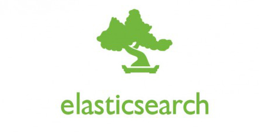

# 极客学院 Wiki Weekly Newsletter  
 
**(2015年9月6日~11日）**

 

## 精品课程

[《Node.js 官方文档中文版》](http://wiki.jikexueyuan.com/project/nodejs/)——Node.js 是一个基于Chrome JavaScript 运行时建立的平台， 用于方便地搭建响应速度快、易于扩展的网络应用。本文档从引用参考和概念两个方面全面的解释了 Node.js API。每个章节描述了一个模块或高级概念。

[《Elasticsearch 权威指南（中文版）》](http://wiki.jikexueyuan.com/project/elasticsearch-definitive-guide-cn/)——Elasticsearch 是一个实时分布式搜索和分析引擎。它让你以前所未有的速度处理大数据成为可能。它用于全文搜索、结构化搜索、分析以及将这三者混合使用。该书由 [Looly](http://www.xiaoleilu.com/) 授权极客学院 Wiki 托管发布。

[《D3.js 入门教程》](http://wiki.jikexueyuan.com/project/d3wiki/)——近年来，可视化越来越流行，许多报刊杂志、门户网站、新闻媒体都大量使用可视化技术，使得复杂的数据和文字变得十分容易理解，有一句谚语“一张图片价值于一千个字”，正是如此，D3 慢慢开始进入人们视野。作者[馒头华华](http://blog.csdn.net/lzhlzz)，作为 D3 领域的专家，根据工作总结，编写了这部适合初学者入门的可视化经典教程。

[《iOS 安全攻防》](http://wiki.jikexueyuan.com/project/ios-security-defense/)——你的 iOS 应用可能正在被其他对手反向工程、跟踪和操纵！你的应用是否依旧裸奔毫不防御？本课程由资深 iOS 程序媛[念茜](http://blog.csdn.net/yiyaaixuexi)编写，重点讲解了 iOS 的常用攻击手段，以及黑客们常用的工具和技术，并通过 Hack 实战案例（支付宝 App ) 详细分析了攻击的方式和原理。

[《学用 JavaScript 设计模式》](http://wiki.jikexueyuan.com/project/javascript-design-patterns/)——设计模式如此让人着迷，以至在任何编程语言中都有对其进行的探索。其中一个原因是它可以让我们站在巨人的肩膀上，获得前人所有的经验，保证我们以优雅的方式组织我们的代码，满足我们解决问题所需要的条件。本书将阐述 JavaScript 编程语言中那些经典和新颖的设计模式。

## 本周上线

- [《深入理解 Android 之 Gradle》](http://wiki.jikexueyuan.com/project/deep-android-gradle/)

- [《Android Weekly 中文版 》169期](http://wiki.jikexueyuan.com/project/android-weekly/issue-169/index.html)

## 课程预报

- 《Dart 编码风格指南》——当我们构建好了 Dart 编码系统时，使用一致的编码风格是很重要的。本教程是精心编写的 Dart 风格指南，旨在帮助大家了解该语言独有的特性，并且让 Dart 开发者之间的协作更加容易。

- 《Gradle User Guide 中文版》——Gradle 的核心是基于 Groovy 的领域特定语言 (DSL), 具有十分优秀的扩展性。本书讲述 Gradle 本身的具有哪些优秀特点，并对其做了系统的分析。

- 《Python 学习笔记》——作者 [雨痕](https://github.com/qyuhen) 个人学习总结，适合 Python 新手参考学习，目前已经发布第二版。

## Wiki News

### 30 天急速前进

Java 零基础入门计划，一个专为小白设计的 Java 入门计划，让你感受学习的速度与激情。为什么要学习 Java，我们给出的理由是：

- 它是基础，学 Android，学大数据，学 Javaweb，都必须要懂 Java。
- 它运用最广，全球 900 万人都在用它。最受程序员欢迎的编程语言，没有之一。
- 它优点最多，它面向对象，分布式，可移植，性能优异、多线程各种优点。

绿色通道：<http://jiuye.jikexueyuan.com/train/java?huodong=jiuye_java_shouye_banner_0910>

### 开学助跑，极客礼包随便领

9 月 1 日-9 月 15 日，极客学院推出开学大礼包，礼包内容包含精品技术书籍、实用求职技巧、精美简历模板、极客学院 VIP 等，每 500 人就会选出 5 人，目前已经有 9000 人参与，速度来抽奖吧。

绿色通道：<http://huodong.jikexueyuan.com/kaixuezhupao?huodong=kaixuezhupao_shouye_banner_0901>

## 联系我们

QQ 群：323037186

Email：wiki@jikexueyuan.com

邮件订阅： <http://tinyletter.com/jikexueyuanwiki>