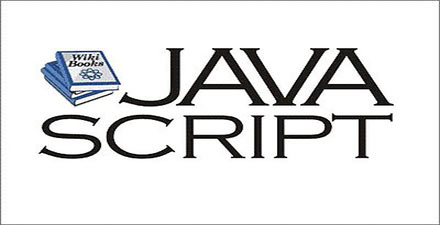

# 极客学院 Wiki Weekly Newsletter 
 
**(2015年11月22日~27日） 第 16 期**                                                 

 

## 精品课程

[《Android NDK 开发教程》](http://wiki.jikexueyuan.com/project/android-ndk-development-tutorial/)——NDK 是一系列工具的集合，帮助开发者快速开发 C（或 C++）的动态库，并能自动将 so 和 java 应用一起打包成 apk。这些工具对开发者的帮助是巨大的。NDK 将是 Android 平台支持 C 开发的开端。本教程从 NDK 安装，调试，基本示例代码等角度，帮助读者系统的学习如何使用 NDK 进行开发。

[《JavaScript 秘密花园》](http://wiki.jikexueyuan.com/project/javascript-garden/)—JavaScript 秘密花园是一个不断更新，主要关心 JavaScript 一些古怪新奇用法的文档。 对于如何避免常见的错误，难以发现的问题，以及性能问题和不好的实践给出建议。

[《Ruby 中文版》](http://wiki.jikexueyuan.com/project/ruby/)——Ruby 是一种跨平台、面向对象的动态类型编程语言。Ruby 体现了表达的一致性和简单性，它不仅是一门编程语言，更是表达想法的一种简练方式。本教程面向初学者，内容涵盖基础与进阶。

[《HASKELL 趣学指南》](http://wiki.jikexueyuan.com/project/haskell-guide/)——Haskell 是一种标准化的、通用纯函数式编程语言，有非限定性语义和强静态类型。作者通过阅读不同的 Haskell 教学文章，从多个角度出发把这些知识化整为零。这份教学是希望提供更多的机会能让你找到你想要得到的解答。希望能够分享我的学习经验，帮助初学者更快进入状况。

[《Mybatis 实战教程》](http://wiki.jikexueyuan.com/project/mybatis-in-action/)——MyBatis 是支持普通 SQL 查询，存储过程和高级映射的优秀持久层框架。MyBatis 消除了几乎所有的 JDBC 代码和参数的手工设置以及结果集的检索。MyBatis 使用简单的 XML 或注解用于配置和原始映射，将接口和 Java 的 POJOs（Plain Old Java Objects，普通的 Java 对象）映射成数据库中的记录。本教程偏重实践，需要读者动手操作来理解什么是 Mybatis 及 Mybatis 的功能。

## 本周上线

- [《Android Weekly 中文版 》180 期](http://wiki.jikexueyuan.com/project/android-weekly/issue-180/index.html)

- [《深入浅出Java Web》](http://wiki.jikexueyuan.com/project/java-web/)

## 课程预报

- 《Android Weekly 中文版 》181 期——每周报道 Android 最新讯息，把握 Android 国内外现状。（翻译已经全部开源）

- 《Go Web 编程》—— 主要介绍如何使用 Go 语言进行 Web 应用开发。

## Wiki News

### 『极客阅读周』读书送 Kindle

围绕极客 · Wiki，极客学院精心筹备了“极客阅读周”的活动！

现在第一阶段已经结束。我们的20位书评优秀获奖名单及Kindle大奖名单请见这里：<http://qun.jikexueyuan.com/wiki/topic/129>

第二阶段参与请点此进入:<http://qun.jikexueyuan.com/wiki/topic/116?huodong=tieba_tiezi>

## 联系我们

QQ 群：323037186

Email：wiki@jikexueyuan.com

邮件订阅： <http://tinyletter.com/jikexueyuanwiki>

