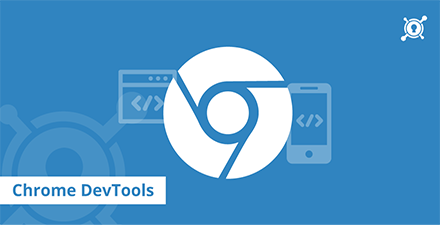
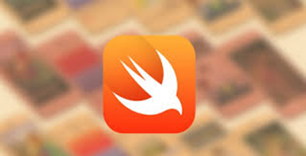

# 极客学院 Wiki Weekly Newsletter 
 
**(2015年11月1日~6日） 第 13 期**                                                 

 

## 精品课程

[《Chrome 开发工具指南》](http://wiki.jikexueyuan.com/project/chrome-devtools/)——谷歌 Chrome 开发工具，是基于谷歌浏览器内含的一套网页制作和调试工具。本指南将会带你从头开始使用学习如何利用 Google 提供的组件进行 Chrome 上的相关开发调试工作。通过本指南，你将学会如何使用这些工具，并且学会如何通过它来分析调试提供的 Demo。

[《Hibernate 教程》](http://wiki.jikexueyuan.com/project/hibernate/)——Hibernate 是一个高性能的对象/关系型持久化存储和查询的服务，其遵循开源的 GNU Lesser General Public License (LGPL) 而且可以免费下载。Hibernate 不仅关注于从 Java 类到数据库表的映射（也有 Java 数据类型到 SQL 数据类型的映射），另外也提供了数据查询和检索服务。这个教程将指导你如何以简单的方式使用 Hibernate 来开发基于数据库的 Web 应用程序。

[《Axure RP 指南》](http://wiki.jikexueyuan.com/project/axure/)——Axure RP 是一个专业的快速原型设计工具，是产品经理（Product Manager）的首选利器，没有之一。它能够让我们快速创建应用软件或 Web 网站的线框图、流程图、原型和规格说明文档。作为专业的原型设计工具，它能快速、高效的创建原型，同时支持多人协作设计和版本控制管理。

[《常用 JavaScript 网页特效》](http://wiki.jikexueyuan.com/project/javascript-special-efficacy-examples/)——本文讲解了一些关于网页特效的 JavaScript 例子,有些例子是为了更好的理解 JS 里的某些知识（属于笔记性质），有些是出于好奇（窗口、日期），还有些是书上看到的好例子。本文采用实例讲解的方式，向读者展示这些网页特效是如何实现的。

[《The Swift Programming Language 中文版》](http://wiki.jikexueyuan.com/project/swift/)——Swift 是一种新的编程语言，用于编写 iOS，OS X 和 watchOS 应用程序。Swift 结合了 C 和 Objective-C 的优点并且不受 C 兼容性的限制。Swift 采用安全的编程模式并添加了很多新特性，这将使编程更简单，更灵活，也更有趣。Swift 取代 Objective-C 已经是未来的趋势，从现在起学习一点都不会晚。

## 本周上线

- [《Android Weekly 中文版 》177 期](http://wiki.jikexueyuan.com/project/android-weekly/issue-177/index.html)

- [《Material Design 中文版》](http://wiki.jikexueyuan.com/project/material-design/)修订影响阅读体验的图片，对部分章节进行校对。修订后的版本更方便读者理解。

## 课程预报

- 《Android Weekly 中文版 》178 期——每周报道 Android 最新讯息，把握 Android 国内外现状。

- 《Laravel 5.1 中文版》——最流行的 PHP 框架，中文版发布了，此版本为 LTS （稳定版），敬请期待。

## Wiki News

### 极客学院社群功能即将上线

你心目中的理想技术社区是什么样子？能够个性化、技术氛围浓厚、界面简洁、信息密度大、各种大牛解答？如果你只要求这几点，那么我们很高兴的通知您，我们这里就有。一个属于极客的社群，可以创建自己的感兴趣的主题并邀请人来作答；去除以往社区各种点赞制度，强化技术氛围主导；简洁的界面，不一样的极客体验；各领域技术讨论，让你能够掌握最全信息；各位公司专业人士、极客布道师开贴讲解技术人生。如有期待，现在就可以进来参与，不删档内测。

绿色通道：<http://qun.jikexueyuan.com>

### 双 11 好礼送

你若敢买，我便敢送。买的越多，送的越多。据说有独家秘笈出售、连就业班都跟着凑热闹了。

活动时间：2015年11月4日～2015年11月12日

想要实惠的请点：[双 11 最惠玩儿](http://huodong.jikexueyuan.com/20151111?huodong=1111_shouye_banner_1104)

## 联系我们

QQ 群：323037186

Email：wiki@jikexueyuan.com

邮件订阅： <http://tinyletter.com/jikexueyuanwiki>

