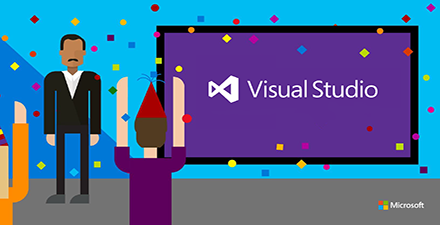
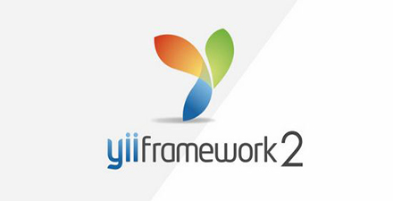
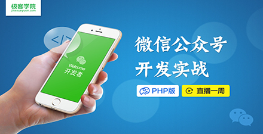

# 极客学院 Wiki Weekly Newsletter 
 
**(2016年4月3日~4月8日） 第 33 期**                                                 

 

## 精品课程

[《带你玩转 Visual Studio》](http://wiki.jikexueyuan.com/project/visual-studio/)——Visual Studio，简称 VS，是微软公司提供开发工具集，现主要应用于 C# 和C++ 开发使用。

[《Yii 2.0 权威指南》](http://wiki.jikexueyuan.com/project/yii-2.0-guide/)——Yii 是一个高性能，基于组件的 PHP 框架，用于快速开发现代 Web 应用程序。名字 Yii （读作 易）在中文里有“极致简单与不断演变”两重含义，也可看作 Yes It Is! 的缩写。

[《神奇的 Go 语言》](http://wiki.jikexueyuan.com/project/magical-go/)——Go 语言是 Google 于 2009 年发布的第二款开源的编程语言。Go 语言的特点：准对多处理器应用程序的编程进行了优化，使用 Go 编译程序可以媲美 C 或 C++ 的代码速度，而且拥有 Python 解释语言的简洁和开发效率。本教程首先介绍了 Go 语言的基础知识和基本语法，然后通过几个具体的示例，展示 Go 语言的特点，方便开发者了解这门语言的特性。

[《Android 百战经典》](http://wiki.jikexueyuan.com/project/android-war/)——本书通过鲜活有趣的实例，让你在玩乐中慢慢培养对Android开发的浓厚兴趣。伟大的科学家爱因斯坦说过“兴趣是最好的老师”，当你对一项技术产生兴趣的时候，你所要做的就是和它游戏，掌握它只是顺带的事情。本书第一卷讲解了二十个生动的小例子，读者可以通过实践让它们在自己的手机上跑起来。下面就跟着我一起愉快地进入Android开发的游戏世界吧。

[《Java 语言快速入门》](http://wiki.jikexueyuan.com/project/java/)——Java 是一种高级的编程语言，它最初是由 Sun 公司开发并于 1995 年公开发布的。Java 可以在不同的平台上运行，例如：Windows，Mac OS 和不同版本的 Unix。本指南将让你对 Java 有一个彻底的认识与了解。本指南将带你用简单并且实用的方法来学习 Java 编程语言。

## Wiki News

### 7天微信开发实战

<http://xuexi.jikexueyuan.com/course/2.html>

## 本周上线

- [Android Weekly 中文版 Issue #199](http://wiki.jikexueyuan.com/project/android-weekly/issue-198/index.html)

- [PM 周刊第 21 期](http://wiki.jikexueyuan.com/project/pmweekly/20.html)

## 课程预报

- 《Java 微信公众号开发实战》——终于有 Java 版的微信开发实战了，喝彩下，后续老师还会出视频版，敬请关注。

## 联系我们

QQ 群：323037186

Email：wiki@jikexueyuan.com

邮件订阅： <http://tinyletter.com/jikexueyuanwiki>

