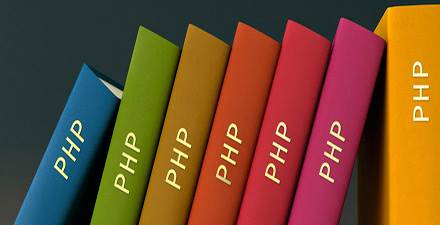

# 极客学院 Wiki Weekly Newsletter 
 
**(2016年3月27日~4月1日） 第 32 期**                                                 

 

## 精品课程

[《PHP 基础教程（精简版）》](http://wiki.jikexueyuan.com/project/php-basics-notes/)——PHP 最为目前流行的服务器端开发语言，深受各大互联网工程师的喜爱。本教程是 PHP 语言的基础教程，根据作者学习 PHP 语言，遇到的知识点总结而成。是一本不错的具有手册性质的教程。能够让读者快速掌握 PHP 的要点。

[《Android Studio 操作手册》](http://wiki.jikexueyuan.com/list/android/)——Android 官方已经选定 Android Studio 为其官方开发工具，并且已经不再支持 Eclipse ADT 的更新。本教程手把手教会大家从如下几个方面来使用 Android Studio：下载、安装、设置、运行以及 Gradle 常见命令和多渠道打包。

[《Django 中文文档 1.8》](http://wiki.jikexueyuan.com/project/django-chinese-docs-1.8/)——本文档的目标是给你描述足够的技术细节能让你理解Django是如何工作的，但是它并不表示是一个新手指南或参考目录 – 其实这些我们都有! 当你准备新建一个项目，你可以 从新手指南开始 或者 深入阅读详细的文档.

[《沉浸式学 Git》](http://wiki.jikexueyuan.com/project/git-immersion/)——沉浸式学 Git 是一份强调通过实践来掌握 Git 基础用法的指南。本书包含 52 个实验，这些实验经过精心设计，篇幅皆十分短小，只需几分钟时间便可完成。对于想要快速学习 Git 的朋友而言，这是一本不可多得的好书。

[《Rust 编程语言 1.7》](http://wiki.jikexueyuan.com/project/rust-1.7/)——Rust 是一个注重安全与速度的现代系统编程语言。本文档为 The Rust Programming Language 的中文翻译。

## Wiki News

### 极客直播课，助你职业技能的提升

极客学院将于 4月8日和4月11日 开通2们视频直播课，课程主要帮助当前有职业瓶颈期的人学习新的技能。

>暂时开课两们，为保证教学质量，课程班不超过200人，课程偏重实战，请认真阅读课程大纲后报名。
>
>课程形式：直播+课堂问答+课后作业+行业指导

### 30天学会Android自动化测试

<http://xuexi.jikexueyuan.com/course/1.html>

### 7天微信开发实战

<http://xuexi.jikexueyuan.com/course/2.html>

## 本周上线

- [《极客周刊》第十期 ](http://wiki.jikexueyuan.com/project/geek-weekly-newsletter/issues-10/newsletter-ten.html)

- [Android Weekly 中文版 Issue #198](http://wiki.jikexueyuan.com/project/android-weekly/issue-198/index.html)

- [PM 周刊第 20 期](http://wiki.jikexueyuan.com/project/pmweekly/20.html)

## 课程预报

- 《Java 微信公众号开发实战》——终于有 Java 版的微信开发实战了，喝彩下。

## 联系我们

QQ 群：323037186

Email：wiki@jikexueyuan.com

邮件订阅： <http://tinyletter.com/jikexueyuanwiki>

