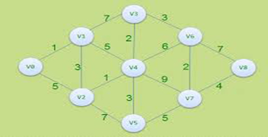
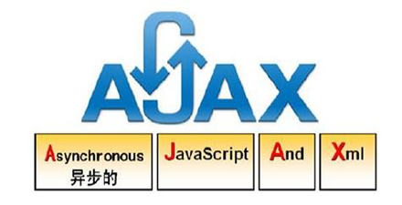

# 极客学院 Wiki Weekly Newsletter 
 
**(2015年10月25日~30日） 第 12 期**                                                 

 

## 精品课程

[《Pro Git v2 中文版》](http://wiki.jikexueyuan.com/project/pro-git-two/)——Git 是一款免费、开源的分布式版本控制系统，用于敏捷高效地处理任何或小或大的项目。本书是第一版的加强版，添加了 Git 在日常开发工具中的使用，Git 嵌入自己的系统及 Git 快速参考。是一部完整的 Git 学习指南。

[《Maven 教程》](http://wiki.jikexueyuan.com/project/maven/)——Apache Maven 是一套软件工程管理和整合工具。基于工程对象模型（POM）的概念，通过一个中央信息管理模块，Maven 能够管理项目的构建、报告和文档。本教程将教你如何在使用 Java 开发的工程中，或者任何其他编程语言中使用 Maven。

[《杰出产品经理书》](http://wiki.jikexueyuan.com/project/jie-chu-pm/)——本书是资深产品经理唐杰花费三年时间整理而成，希望能帮助到迷茫的产品新人们。全书以三个核心价值(方法论+案例分析+系统化梳理 PM 工作)为基础，为新做产品经理的人讲解了一些方法论，因为对于新人来说，在没有丰富的经验积累的时候，就非常需要一些做产品的方法。学完了方法论，有了理论基础之后，开始引入产品规划和设计以及产品管理等等方面的经验知识。最后梳理了产品经理的整个工作。

[《一步一步写算法》](http://wiki.jikexueyuan.com/project/step-by-step-learning-algorithm/)——如果一个人只知道算法，但是不能用编程语言很好地实现，那么再优秀的算法也不能发挥作用。一个人只有有了很好的计算机知识和数学知识，才能在算法的学习上不断进步。不管算法多么简单，都要自己亲手实践，只有不断认识错误、不断发现错误，才能不断提高自己的编程能力，不断提高自己的业务水平。这里取名一步一步写算法的目的主要有两个：第一，保证我们的算法都是大家可以学得会，看的懂的；第二，保证我们的算法是健壮的、可以测试的。所以在编写的过程中，我们的算法开发过程是伴随着测试用例增加的，没有测试用例保证的代码只是一段无序的字符而已，没有什么价值。

[《Ajax 教程》](http://wiki.jikexueyuan.com/project/ajax/)——Ajax 是一种用于创建交互式 Web 应用程序的 Web 开发技术。本教程适用于想要学习如何创建交互式网页以及使用 Ajax 改善速度和可用性的 Web 开发人员。如果你知道 JavaScript，HTML，CSS 和 XML，那么你只需要花费 1 个小时就能掌握 Ajax。

## 本周上线

- [《Android Weekly 中文版 》176 期](http://wiki.jikexueyuan.com/project/android-weekly/issue-176/index.html)

- [《Erlang 编程规则》](http://wiki.jikexueyuan.com/project/erlang-programming-rules/)

- [《Groovy 入门》](http://wiki.jikexueyuan.com/project/groovy-introduction/)

## 课程预报

- 《Android Weekly 中文版 》177 期——每周报道 Android 最新讯息。

- 《Laravel 5.1 中文版》——最流行的 PHP 框架，中文版发布了，下周敬请期待。

## Wiki News

### 极客学院首页 Wiki 版块正式上线！

进入主站首页后，在知识体系图下方会显示完整的 Wiki 版块，内容包括推荐、最新和热门 Wiki 课程。
Wiki 版块上线后，除已上线的导航栏 Wiki 入口外，用户可以通过该版块快速访问我们为用户推荐的精品课程，更加清晰的分类和更加精准的推荐可以让更多的高质量 Wiki 课程为用户服务，让极客学院的品牌更加深入人心！

## 联系我们

QQ 群：323037186

Email：wiki@jikexueyuan.com

邮件订阅： <http://tinyletter.com/jikexueyuanwiki>

