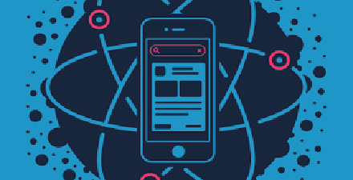
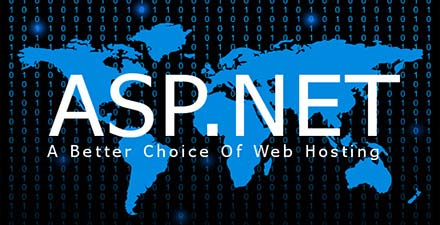

# 极客学院 Wiki Weekly Newsletter 
 
**(2016年2月28日~3月4日） 第 28 期**                                                 

 

## 精品课程

[《SEO 教程》](http://wiki.jikexueyuan.com/project/seo/)——SEO是由英文Search Engine Optimization缩写而来， 中文意译为“搜索引擎优化”。SEO是指通过对网站内部调整优化及站外优化，使网站满足搜索引擎收录排名需求，在搜索引擎中提高关键词排名，从而把精准用户带到网站，获得免费流量，产生直接销售或品牌推广。本文是一套完整的 SEO 学习资料，从基础入门知识到实战经验分享均在此教程中有所体现，适合初学者学习。

[《Vue.js 教程》](http://wiki.jikexueyuan.com/project/vue-js-1.0/)——Vue.js 是一个用于创建 Web 交互界面的库。它让你通过简单而灵活的 API 创建由数据驱动的 UI 组件。本教程是 Vue.js 1.0版。

[《React-Native 入门指南》](http://wiki.jikexueyuan.com/project/react-native-lesson/)——《React Native入门与实战》的姐妹篇，作者[王利华](http://vczero.github.io/) 根据日常开发经验汇总此指南，偏重实践，需要有一点基础的人学习。

[《代码能有多难？》](http://wiki.jikexueyuan.com/project/easy-web-code-book/)——本书适合于零基础的小白们，高手请飞过，因为在你看起来本书行文会显得比较的拖沓，当然你拿它当段子三百首看我也是十分开心的。然后就是那些太白的小白也爬过吧，虽然代码很简单，我讲得也很细致，但是我还是不能从切换中英文输入法讲起的，换言之，你总是要懂得日常的电脑操作方法我们才有交流的基础。希望这个要求你不会觉得太高。

[《ASP.NET Web API 中文版》](http://wiki.jikexueyuan.com/project/web-api-book//)——ASP.NET Web API 是一种框架，用于轻松构建可以访问多种客户端（包括浏览器和移动设备）的 HTTP 服务。本教程是国外个人博客翻译整理而成，主要从基础开始讲起，中间重点突出ASP.NET路由， 最后实战部分，主要介绍各种数据处理技术。

## Wiki News

### 优惠送书活动获奖名单公布

表达出你们对Web大前端的热爱，轻松拿走《JavaScript设计模式&开发实践》活动获奖名单公布。

查看入口:<http://qun.jikexueyuan.com/activity/topic/363?huodong=jsmd_banner_0301>

### 本周开通下载的书籍

- [极客学院 IT 文摘](http://wiki.jikexueyuan.com/project/geekdigest/)
- [Ghost使用指南](http://wiki.jikexueyuan.com/project/ghost-user-guide/)
- [How to be a Programmer 中文版](http://wiki.jikexueyuan.com/project/how-to-be-a-programmer/)
- [Apple Pay 编程指南](http://wiki.jikexueyuan.com/project/apple-pay/)

## 本周上线

- [《极客周刊》第六期 ](http://wiki.jikexueyuan.com/project/geek-weekly-newsletter/issues-6/newsletter-six.html)

- [React-Native入门指南](http://wiki.jikexueyuan.com/project/react-native-lesson/)

- [ASP.NET Web API 中文版](http://wiki.jikexueyuan.com/project/web-api-book/)

- [Android Weekly 中文版 Issue #194](http://wiki.jikexueyuan.com/project/android-weekly/issue-194/index.html)

- [PM 周刊第16期](http://wiki.jikexueyuan.com/project/pmweekly/16.html)

## 课程预报

- 《In-App Purchase 编程指南》——苹果支付方式之一，iOS 开发工程师都需要掌握的技术。

- 《JavaScript 函数式编程》——“Clojure is Awesome, but JavaScript reaches”，且看作者如何用 JavaScript 讲解函数式编程模式。

## 联系我们

QQ 群：323037186

Email：wiki@jikexueyuan.com

邮件订阅： <http://tinyletter.com/jikexueyuanwiki>

