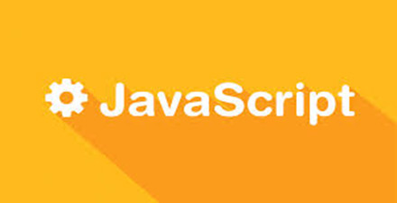

# 极客学院 Wiki Weekly Newsletter 
 
**(2016年3月6日~3月11日） 第 29 期**                                                 

 

## 精品课程

[《Django 中文文档 1.8（连载）》](http://wiki.jikexueyuan.com/project/django-chinese-docs-18/)——随着 Python 的火热，这款由 Python 编写的Web框架也随之崛起。[Django 文档协作翻译小组](http://python.usyiyi.cn/django/index.html) 组织翻译，如有兴趣可以参与翻译。

[《iOS IAP 教程》](http://wiki.jikexueyuan.com/project/in-app-purchase/)——IAP，英文全称In-App Purchase，是指在iPhone App（苹果应用商店）中出现的“软件内付费内容”。本教程是官方文档翻译版，主要涉及配置、开发、具体应用等内容。

[《leetCode 题解 （多语言版）》](http://wiki.jikexueyuan.com/project/leetcode-book/)——leetCode 是一个美国的在线编程网站，上面主要收集了各大IT公司的笔试面试题，对于应届毕业生找工作是一个不可多得的好帮手。此版本是多种语言版本，答案来自作者个人整理。

[《ClojureScript 函数编程》](http://wiki.jikexueyuan.com/project/clojure-flavored-javascript/)——原名 ：clojure flavored javascript。Rich Hickey 所言——“Clojure is Awesome, but JavaScript reaches”。Clojure 是跑着 JVM 上的 lisp 方言，而 ClojureScript 是能编译成 JavaScript 的 Clojure。本文内容主要是讲解函数式编程、并发和集合，需要有一定函数式编程基础的人学习。

[《Sketch 3 的用户手册》](http://wiki.jikexueyuan.com/project/sketch-3/)——Sketch 是一款矢量绘图应用，矢量绘图也是目前进行网页——特别是移动应用设计，图标以及界面设计的最好方式。本手册系统讲述了 Sketch 的基础知识，通过列举案例，帮助读者逐步掌握 Sketch 设计技术。

## Wiki News

### 极客学院个人成绩单

我们的数据记录了你在极客学院的每一天。

快快点击查看吧：<http://huodong.jikexueyuan.com/2016325/chengjidan?huodong=chengjidan_banner_0310>

### 本周开通下载的书籍

- [Vue.js 教程](http://wiki.jikexueyuan.com/project/vue-js-1.0/)

- [React Native 入门指南](http://wiki.jikexueyuan.com/project/react-native-lesson/)

- [iOS IAP 教程](http://wiki.jikexueyuan.com/project/in-app-purchase/)

## 本周上线

- [《极客周刊》第七期 ](http://wiki.jikexueyuan.com/project/geek-weekly-newsletter/issues-7/newsletter-seven.html)

- [PHP 之道](http://wiki.jikexueyuan.com/project/php-right-way-new/)

- [LeetCode 题解](http://wiki.jikexueyuan.com/project/leetcode-book/)

- [Android Weekly 中文版 Issue #195](http://wiki.jikexueyuan.com/project/android-weekly/issue-195/index.html)

- [PM 周刊第 17 期](http://wiki.jikexueyuan.com/project/pmweekly/17.html)

## 课程预报

- 《Animation 动画详解》——Android 动画设计开发高级教程，手把手教你制作自己的动画效果。

- 《Reactor 指南中文版》——每秒钟可处理 1500 万事件的高效 JVM 库。

## 联系我们

QQ 群：323037186

Email：wiki@jikexueyuan.com

邮件订阅： <http://tinyletter.com/jikexueyuanwiki>

