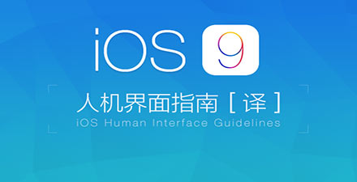

# 极客学院 Wiki Weekly Newsletter 
 
**(2015年12月27日~1月1日） 第 21 期**                                                 

 

## 精品课程

[《Mac 开发配置手册》](http://wiki.jikexueyuan.com/project/mac-dev-setup/)——手册内容为「如何让一部全新的 MacBook 快速完成开发环境配置」，主要面向 Web 开发者。其中的指导，在 Mavericks 和Yosemite 上有效，其他版本系统并未尝试。

[《iOS 9人机界面指南》](http://wiki.jikexueyuan.com/project/ios-nine/)——iOS 9 人机界面指南翻译的内容为 iPhoneHIG 的设计规范，旨在帮助交互设计师和应用开发者了解苹果应用设计规范， 设计 iPhone 应用程序的用户界面，了解那些用于创建 iPhone 应用程序的用户界面的元素，同时还描述了各种可用的视图和控件并提 供了如何有效使用它们的说明。

[《Redis开发运维实践指南》](http://wiki.jikexueyuan.com/project/all-about-redis/)——中国民生银行总行科技部工程师——黄鹏程个人工作经验总结，包含开发和运维的各方面的使用、应用场景和最佳实践，以及各个高可用架构的搭建和测试。

[《像 geek 一样写博客》](http://wiki.jikexueyuan.com/project/github-page/)——Octopress 是一款优秀的静态化博客系统，也是一个本地化的博客系统，之前部落在介绍免费开源 Github Pages空间时有提到过 Octopress，Github 为我们提供长期稳定的免费空间服务，但是 Github 空间不是一般意义上的PHP或者 ASP 空间。Github 是一个代码托管空间，我们常用的一些 PHP 应用程序都无法在 Github 空间上运行。Octopress 作为一个本地化的博客，官方将它简称为：“A blogging framework for hackers.”，也就是 Octopress 只适合那些经常玩 Linux、写代码的朋友用的博客系统。

[《C# 中一些易混淆概念总结》](http://wiki.jikexueyuan.com/project/csharp-confusing-concepts-summary/)——本文主要面向 C#基础知识学习者, 作者通过亲身学习与调查, 整理出初学者容易理解不清楚和混淆的概念。

## Wiki News

### 火速围观竞猜，500元红包飞来

值此新年到来之际，极客学院举办『有你‘极’好，感恩相伴』活动，竞猜即送100元学费抵用券！猜中者可获现金红包。“最佳极客奖”最终花落谁家？你最看好哪一位实战教练？

猛戳这里参与<http://huodong.jikexueyuan.com/younijihao?hmsr=jiaofu_younijihao_wiki>

### 老罗力荐 OpenResty

《OpenResty最佳实践》，负责人WenMing授权Wiki发布。

这本书的定位是最佳实践，同时会对OpenResty做简单的基础介绍。但是我们对初学者的建议是，在看书的同时下载并安装OpenResty，把官方网站的Presentations浏览和实践几遍。

请一直使用最新的Openresty版本来运行本书的代码。

希望你能enjoy OpenResty之旅！

学习地址：<http://wiki.jikexueyuan.com/project/openresty/>

## 本周上线

- [《Android Weekly 中文版 》185 期](http://wiki.jikexueyuan.com/project/android-weekly/issue-185/index.html)译者：[Titanjum](https://github.com/JungleTian)

- [《PM 周刊》第 11 期](http://wiki.jikexueyuan.com/project/pmweekly/11.html)之《产品经理最重要的能力》

- [《iOS 9 人机交互指南》](http://wiki.jikexueyuan.com/project/ios-9-human-computer-interface-guidelines/)

- [《Redis开发运维实践指南》](http://wiki.jikexueyuan.com/project/all-about-redis/)

## 课程预报

- 《Android Weekly 中文版 》186 期——每周报道 Android 最新讯息，把握 Android 国内外现状。

- 《PM 周刊》第 12 期—— 产品经理界最实用干货，开拓的不仅仅是视野。

- 《神经网络与深度学习》Neural Networks and Deep Learning 的中文译本。

## 联系我们

QQ 群：323037186

Email：wiki@jikexueyuan.com

邮件订阅： <http://tinyletter.com/jikexueyuanwiki>

