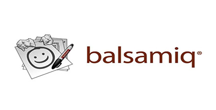

# 极客学院 Wiki Weekly Newsletter 
 
**(2016年2月21日~2月26日） 第 27 期**                                                 

 

## 精品课程

[《Apple Pay 编程指南》](http://wiki.jikexueyuan.com/project/ios-9-human-computer-interface-guidelines/)——在发布近两年、历经各种周折之后，苹果的Apple Pay移动支付服务终于在2016年2月18日来到了中国大陆。Apple Pay 是一种移动支付技术，它能够让用户以一种便捷安全的方式为现实世界中购买的商品和服务付款。本教程是 《Apple Pay Programming Guide》 官方文档翻译版。主要讲解 关于Apple Pay、配置支付环境、创建支付请求、授权支付、处理支付等内容。

[《Atom飞行手册翻译》](http://wiki.jikexueyuan.com/project/atom-flight-manual-zh-cn/)——作为目前最流行的编辑器，这篇教程无疑是一个很好的学习手册，从介绍 Atom 开始，到各种插件和功能使用，然你了解到，Atom 不仅仅是一个编辑器，它更像是一个待完善的个人系统。本教程翻译自 [Atom Flight Manual](https://atom.io/docs)。

[《How to be a Programmer 中文版》](http://wiki.jikexueyuan.com/project/how-to-be-a-programmer/)——做一个好的程序员是困难而高尚的。将一个软件工程集体愿景变为现实，最困难的地方在于与你的同事和顾客相处。编程，而且需要巨大的智力和技能。 但与好的程序员构建一个让自己所负责的客户和各种各样的同事都满意的软件系统做的那些事相比，（纯粹的）编程真的只是小孩子的玩意。在这篇文章里，我尝试尽可能简洁地总结那些当我21岁时希望别人告诉我的事。

[《 Google JSON 风格指南》](http://wiki.jikexueyuan.com/project/google-json-style-guide/)——该风格指南是对在Google创建JSON APIs而提供的指导性准则和建议。总体来讲，JSON APIs应遵循JSON.org上的规范。这份风格指南澄清和标准化了特定情况，从而使Google的JSON APIs有一种标准的外观和感觉。这些指南适用于基于RPC和基于REST风格的API的JSON请求和响应。

[《Balsamiq Mockups 3 中文教程》](http://wiki.jikexueyuan.com/project/balsamiq-mockups-doc/)——Balsamiq Mockups 如此受欢迎的原因是在软件产品原型图设计领域，特别是 Web 原型图设计领域，还没有哪款产品有如此丰富的表现形式。使用 Balsamiq Mockups 画出的原型图都是手绘风格的图像，看上去非常美观、清爽。它支持几乎所有的 HTML 控件原型图，此外它还支持目前如火如荼的 iPhone 手机元素原型图，这为开发 iPhone 应用程序的软件工程师提供了非常好的设计图。目前国内许多知名的互联网公司都推荐使用它进行原型设计。

## Wiki News

极客学院网站、App视频课程全线免费啦！

春节假期的App限免活动，让各位爱学习的小伙伴大呼过瘾，但也有人忙着吃吃吃而错过了千载难逢的机会。

为鼓励更多小伙伴学习，极客学院将活动重磅升级，为大家带来终极福利！

**2.22-2.29**期间，极客学院网站视频课程全部免费！全部免费！全部免费！

只要登录就可以学习全部课程哦！

## 本周上线

- [《极客周刊》第五期 ](http://wiki.jikexueyuan.com/project/geek-weekly-newsletter/issues-5/newsletter-five.html)

- [Ghost使用指南](http://wiki.jikexueyuan.com/project/ghost-user-guide/)

- [Android Weekly 中文版 Issue #193](http://wiki.jikexueyuan.com/project/android-weekly/issue-193/index.html)

- [PM 周刊第15期](http://wiki.jikexueyuan.com/project/pmweekly/15.html)

## 课程预报

- 《Vim 教程》——Vim 是终端文本编辑器Vi的加强版本,加入了更多特性来帮助编辑源代码。Vim的一部分增强功能包括文件比较（vimdiff），语法高亮，全面的帮助系统，本地脚本（vimscript），和便于选择的可视化模式。
Vim专注于键盘操作，它并不是像nano或pico一样的简单编辑器。

- 《代码能有多难？》——从设计师的角度看编程。

## 联系我们

QQ 群：323037186

Email：wiki@jikexueyuan.com

邮件订阅： <http://tinyletter.com/jikexueyuanwiki>

