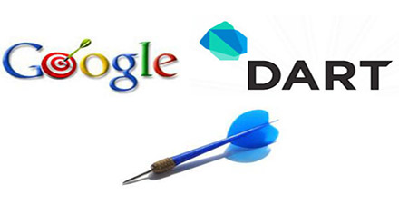

# 极客学院 Wiki Weekly Newsletter 
 
**(2016年2月14日~2月19日） 第 26 期**                                                 

 

## 一年之计在于春

新年伊始，极客学院 Wiki Weekly Newsletter 又与大家见面了，新的一年里，我们将会一如既往的总结优质内容，按时推送给大家。此外，在原有移动开发、后端开发、前端开发等分类的基础上，我们会增加产品设计、测试、运维、SEO、程序员方法论等品类的内容。不断满足同学们的需求，也希望能帮助我们可爱的猿们拓宽视野。最后，愿猿年，大家 BUG 少少，钱多多。

## 精品课程

[《iOS 9人机界面指南》](http://wiki.jikexueyuan.com/project/ios-9-human-computer-interface-guidelines/)——专业团队，腾讯ISUX翻译创作，是国内最全最新的 iOS 设计指南。无论你是 iOS 开发者，还是UI 设计师，都是值得一看的。

[《Dart 入门教程》](http://wiki.jikexueyuan.com/project/dart-get-started/)——Dart 是谷歌在 2011 年推出的编程语言，是一种结构化 Web 编程语言，允许用户通过 Chromium 中所整合的虚拟机（Dart VM）直接运行 Dart 语言编写的程序，免去了单独编译的步骤。以后这些程序将从 Dart VM 更快的性能与较低的启动延迟中受益。Dart 从设计之初就为配合现代 Web 整体运作而考虑，开发团队也同时在持续改进 Dart 向 JavaScript 转换的快速编译器。Dart VM 以及现代 JavaScript 引擎（V8 等）都是 Dart 语言的首选目标平台。这篇教程将会带你从头开始使用 Dart 来写 Web 应用程序. 通过本教程，你将会下载 Dart 软件，并且使用 Dart 编辑器来创建和运行两个小应用。

[《SQL 教程》](http://wiki.jikexueyuan.com/project/sql/)——SQL 是一种数据库语言，被设计用来检索及管理关系数据库中的数据。SQL 是 Structured Query Language（结构化查询语言）的缩写。本教程是一本非常详细的基础教程，涉及常用 SQL 语言的所有知识点，能够让你对 SQL 的语法和语义有个清晰的认识。

[《JDBC 指南》](http://wiki.jikexueyuan.com/project/jdbc/)——JDBC API 是一个 Java API，它可以访问任何类型的表格数据，特别是可以访问存储在关系数据库里的数据。JDBC 可以用 Java 语言在各种平台上实现，比如 Windows 系统， Mac OS 系统，和各种版本的 UNIX 系统。附加 12 个实例，帮你顺利掌握这门数据库操作技术。

[《云计算设计模式》](http://wiki.jikexueyuan.com/project/cloud-design-patterns//)——云带来的改变是显而易见的，云计算是一种按使用量付费的模式，这种模式提供可用的、便捷的、按需的网络访问， 进入可配置的计算资源共享池（资源包括网络，服务器，存储，应用软件，服务），这些资源能够被快速提供，只需投入很少的管理工作，或与服务供应商进行很少的交互。本文提供了 24 种云计算设计模式，能够让读者学习如何设计高可用性、高弹性、低运维、可监控与自动化的云计算平台。

## Wiki News

### Wiki 2.1上线

年前，我们就给偷偷改了，就是为了给大家一个惊喜。

那么我们都更新了什么呢？

- 上方的面包屑导航，方便大家回退
- 左侧课程导航我们仿照 Google 风格改变成可折叠，这样让界面更简洁
- 添加版权标识，尊重作者是我们的原则
- **增加相关资源推荐**，不仅有Wiki，还有视频、文章。多维度帮助大家学习。
- 课程内容区域，增加文字划词和图片的即时分享到微信、微博、QQ空间等社交媒体，希望大家多多宣传

详细的体验，大家可以登录网站查看。如果有任何意见，直接最下方邮件我们，我们需要大家多提产品意见。

## 本周上线

- [《极客周刊》第四期 ](http://wiki.jikexueyuan.com/project/geek-weekly-newsletter/issues-4/newsletter-four.html)

- [iOS 9 人机界面指南](http://wiki.jikexueyuan.com/project/ios-9-human-computer-interface-guidelines/)

## 课程预报

- 《How to be a Programmer 中文版》——程序员界的首选方法论，个中道理，受用终身。

- 《Jekyll • 简单的博客、静态网站工具》——Jekyll 的全面指南。包括一些内容如：搭建和运行你的站点、创建以及管理内容、定制站点的展现和外观、在不同的环境中发布、以及参与到 Jekyll 将来的开发的一些建议。

## 联系我们

QQ 群：323037186

Email：wiki@jikexueyuan.com

邮件订阅： <http://tinyletter.com/jikexueyuanwiki>

