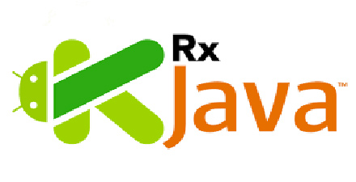
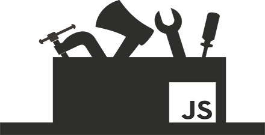
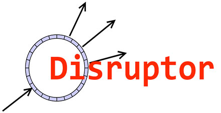

# 极客学院 Wiki Weekly Newsletter 
 
**(2015年1月10日~1月15日） 第 23 期**                                                 

 

## 精品课程

[《程序员的自我修养》](http://wiki.jikexueyuan.com/project/a-programmer-prepares/)——作者 Leo Hui 通过多年程序经验，总结出一套程序员的自我养成手册，内容通俗易懂适合初入行程序员阅读。

[《RxJava Essentials 中文翻译版》](http://wiki.jikexueyuan.com/project/rxjava/)——如果你是一名有经验的Java开发者，reactive编程将会在后端系统中给你一种新的学习扩展和并发的方式，而这不需要更换开发语言。这本书将帮助你学习RxJava的核心方面,也能帮助你克服Android平台局限性从而创建一个基于事件驱动的，响应式的，流畅体验的Android应用。

[《前端开发规范》](http://wiki.jikexueyuan.com/project/web-development/)——此文档主要实现的目标：代码一致性和最佳实践。通过代码风格的一致性，降低维护代码的成本以及改善多人协作的效率。同时遵守最佳实践，确保页面性能得到最佳优化和高效的代码。

[《深入理解 JavaScript》](http://wiki.jikexueyuan.com/project/javascript-depth-understanding/)——深入理解 JavaScript 教程，内容来源包括了原创，翻译，转载，整理等各类型文章，是作者根据实际经验的一个整合。本教程对 JavaScript 语言的函数、原型、闭包、面向对象等关键知识点做了详细介绍；根据实际开发需要，引入设计模式，让读者能够由浅入深地掌握这门语言的特点，解决实际开发过程中的问题。

[《Disruptor 入门》](http://wiki.jikexueyuan.com/project/python3-cookbook/)——Disruptor 是一个高性能的异步处理框架，或者可以认为是最快的消息框架（轻量的 JMS），也可以认为是一个观察者模式的实现，或者事件监听模式的实现。它允许开发者使用多线程技术去创建基于任务的工作流。Disruptor 能用来并行创建任务，同时保证多个处理过程的有序性。Disruptor 的目标就是快. 我们知道，java.util.concurrent.ArrayBlockingQueue 是一个非常优秀的有界队列实现。Disruptor 与之相比，性能更加的优秀。本课程带你理解 Disruptor 的工作原理并让你快速将其应用到工作中。

## Wiki News

### 限免视频课程打包发送

**Python 初级教程**——本套课程主要会让新手接触 Python，让各位同学从零基础开始掌握 Python语言。掌握Python基础知识，Python语法，Python运算符与表达式，三种控制流、Python函数、Python数据结构和算法等知识。

观看下载地址：<http://ke.jikexueyuan.com/xilie/34?huodong=xilie34_banner_0111>

### 【测试】你适合继续从事编程的工作吗？

有人说，编程是份工作，敲得一手花花绿绿的代码，辛苦倒也快乐；
有人说，编程是为了赚钱，码农收入高，少活几年又怎样；
有人说，编程是为了创业，看看扎克伯格、雷军、腾讯的小马哥，都是从写代码开始的；
更有人说，编程来源于热爱，热爱就会坚持，且coding且珍惜……

想要了解更多请点此：[地址链接](http://mp.weixin.qq.com/s?__biz=MjM5ODE0MTM1MA==&mid=401616853&idx=3&sn=ed63ed884ca9fec2a2c0407b918e0668#rd)

## 本周上线

- [《Android Weekly 中文版 》187 期](http://wiki.jikexueyuan.com/project/android-weekly/issue-187/index.html)译者：[Titanjum](https://github.com/JungleTian)

- [《PM 周刊》第 13 期](http://wiki.jikexueyuan.com/project/pmweekly/13.html)之《为什么张小龙说好产品要用完即走？》

- [《程序员自我修养》](http://wiki.jikexueyuan.com/project/a-programmer-prepares/)

- [《RxJava Essentials 中文翻译版》](http://wiki.jikexueyuan.com/project/rxjava/)

## 课程预报

- 《Android Weekly 中文版 》188 期——每周报道 Android 最新讯息，把握 Android 国内外现状。

- 《PM 周刊》第 14 期—— 产品经理界最实用干货，开拓的不仅仅是视野。

## 联系我们

QQ 群：323037186

Email：wiki@jikexueyuan.com

邮件订阅： <http://tinyletter.com/jikexueyuanwiki>

