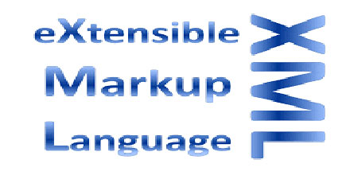
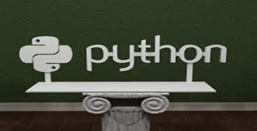

# 极客学院 Wiki Weekly Newsletter 
 
**(2015年1月3日~1月8日） 第 22 期**                                                 

 

## 精品课程

[《极客周刊》](http://wiki.jikexueyuan.com/project/geek-weekly-newsletter/)——我们从互联网的犄角旮旯收罗最有价值的内容汇成此刊，希望能成为你每周必读的一份期待。

[《XML 中文版》](http://wiki.jikexueyuan.com/project/xml/)——XML 即可扩展标记语言，它是一种基于文本的标记语言，源自标准通用标记语言（SGML）。本教程将会教授我们 XML 的基础知识。本教程分为好几个部分，比如 XML 基础，高级 XML 和 XML 工具。每个主题都包含主题相关的简单且实用的例子。

[《JSON 教程》](http://wiki.jikexueyuan.com/project/json/)——本教程会帮助我们了解 JSON 以及如何在各种编程语言，比如 PHP，PERL，Python，Ruby，Java 等等编程语言中使用它。JSON 或者 JavaScript 对象表示法是一种轻量级的基于文本的开放标准，被设计用于可读的数据交换。JSON 格式最初由 Douglas Crockford 提出，使用 RFC 4627 描述。JSON 的官方网络媒体类型是 application/json。

[《Spring Boot Cookbook》阅读笔记](http://wiki.jikexueyuan.com/project/spring-boot/)——本书的内容主要来自《Spring Boot Cookbook》一书，我在阅读这本书的过程中进行了简单的总结和翻译，另外，本书还包括了我自己在项目中使用Spring Boot的实践总结。

[《Python Cookbook》](http://wiki.jikexueyuan.com/project/python3-cookbook/)——Python 3 最全面的技术书籍，面向 Python 高级开发人员。

## Wiki News

### 『PHP工程师』速成学习手册，成为大神不是梦！

PHP 是一种创建动态交互性站点的强有力的服务器端脚本语言。 主要用于 Web 领域。如天猫、 淘宝、新浪、百度、谷歌等网站 都采用了PHP 语言。PHP具有 开源性、快捷性、专注性、跨平 台等特点。

PHP 是免费的，并且使用非常广泛。同时，对于像微软 ASP 这样的竞争者来说，PHP 无疑是另一种高效率的选项。

猛戳这里查看<http://www.jikexueyuan.com/blog/535.html?huodong=php_kuaixun_0106>

## 本周上线

- [《Android Weekly 中文版 》186 期](http://wiki.jikexueyuan.com/project/android-weekly/issue-186/index.html)译者：[Titanjum](https://github.com/JungleTian)

- [《PM 周刊》第 12 期](http://wiki.jikexueyuan.com/project/pmweekly/12.html)之《互联网的变与不变：激扬 2015，盛世 2016》

- [《Spring Boot Cookbook》阅读笔记](http://wiki.jikexueyuan.com/project/spring-boot/)

## 课程预报

- 《Android Weekly 中文版 》187 期——每周报道 Android 最新讯息，把握 Android 国内外现状。

- 《PM 周刊》第 13 期—— 产品经理界最实用干货，开拓的不仅仅是视野。

- 《程序员自我修养》——我所认为的程序员的自我养成手册。

## 联系我们

QQ 群：323037186

Email：wiki@jikexueyuan.com

邮件订阅： <http://tinyletter.com/jikexueyuanwiki>

