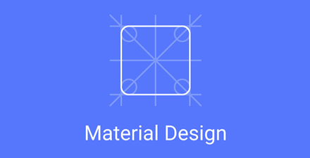

# 极客学院 Wiki Weekly Newsletter  
 
**(2015年8月9日~14日）**

  

## 精品课程

[《深度解析 ECMAScript 6》](http://wiki.jikexueyuan.com/project/es-six-deeply/)ECMAScript 6 简称 “ES6”，ES6 包含了很多新的语言功能，且这些语言功能使得 JavaScript 更加强大更富有表现力。如果你想要了解 ES6 的特别之处，那么本书是个不错选择，本书作者专业且文艺，附有 JS 版 “哈姆雷特” 供大家欣赏。

[《Pixate 使用指南》](http://wiki.jikexueyuan.com/project/pixate-guide/) Pixate 是新一代的手机交互设计工具，目的是帮助设计师脱离代码就可以创建复杂的动画和交互。当设计的时候，平台将产生 100% 原生手机原型，让你获得更好的体验。

[《零基础学 Python》(第二版)](http://wiki.jikexueyuan.com/project/start-learning-python/)
作者老齐又一力作，本书是一本完整的关于 Python 语言学习的书。该书用风趣幽默的语言、丰富的图片、清晰的代码以及完整的实战案例，系统地介绍了 Python 这门当下非常流行的编程语言，是一本非常难得的 Python 学习书籍。该书为同名原书第二版。

[《CodeIgniter 用户指南》](http://wiki.jikexueyuan.com/project/codeigniter-user-guide/)
她是一个小巧但功能强大的 PHP 框架，作为一个简单而“优雅”的工具包，她可以为 PHP 程序员建立功能完善的 Web 应用程序。如果你是一个与人共享主机并且为客户要求的期限而烦恼的开发人员，如果你已经厌倦了那些傻大笨粗的框架，那么 CodeIgniter 就是你所需要的。

[《Material Design 中文版》](http://wiki.jikexueyuan.com/project/windowsappbook/)
Google I/O 2014 发布的 Material Design 将会成为统一 Android，Chrome 等平台的设计语言规范，对从业人员意义重大，本书为官方教程翻译版。

## 本周上线

- [jQuery 教程](http://wiki.jikexueyuan.com/project/jquery/)

- [SWING 教程](http://wiki.jikexueyuan.com/project/swing/)

- [XML 中文版](http://wiki.jikexueyuan.com/project/xml/)

- [Erlang 教程中文版](http://wiki.jikexueyuan.com/project/erlang/)

- [Hibernate 高级教程](http://wiki.jikexueyuan.com/project/hibernate_articles/)

- [D3.js 入门教程](http://wiki.jikexueyuan.com/project/d3wiki/)

- [Mac 开发配置手册](http://wiki.jikexueyuan.com/project/mac-dev-setup/)

- [Vue.js 教程](http://wiki.jikexueyuan.com/project/vue-js/)

- [前端开发规范](http://wiki.jikexueyuan.com/project/web-development/)
 
- [单片机教程(一)](http://wiki.jikexueyuan.com/project/mcu-tutorial-one/)

## 课程预报

- 《WebGL 基础教程》一部全新的，摒弃老旧的设计思想，带你全面了解什么是 WebGL，并知晓其设计原理的教科书。

- 《理解 Linux 进程》本书用 Go 重写了所有示例程序，通过循序渐进的方法介绍 Linux 进程的工作原理和一切你所需要知道的概念。。

- 《单片机教程(二)》单片机又称单片微控制器,它不是完成某一个逻辑功能的芯片,而是把一个计算机系统集成到一个芯片上。相当于一个微型的计算机，和计算机相比，单片机只缺少了I/O设备。本文是全程套教程第二部分。

- 《Android 实战简易教程（连载）》Android 实战简易教程，一步步由浅入深带你领略 Android 的魅力，本教程通过一个个简单实用的例子，向读者展示 Android 应用功能开发过程的始末，帮助读者更好理解每个功能的实现过程和原理。

## Wiki News

### 新版创作指南问世

极客学院 Wiki 已经跟 GitHub 工具完美结合，只需要简单配置，就能完成传统内容创作的全部过程；Markdown 极简编写风格，省去了 word 排版的麻烦；此外，我们还兼容了 Gitbook 用户，现在可以完美迁移了，小小改动，就能多个平台展示。详情请看：<https://github.com/jikexueyuanwiki/guide/blob/master/README.md>

### 极客学院校园大使第三期招募

如果你是在校大学生，如果你想要有个不一样的人生，如果你还不确定你能做什么，那么就趁着年轻，不管不问的，来参加我们的校园大使吧！年轻就是最好的资本，你可别错过......
参与请看：<http://www.jikexueyuan.com/blog/426.html?huodong=dashi_shouye_banner_0810>

## 联系我们

QQ 群：323037186

Email：wiki@jikexueyuan.com

邮件订阅： <http://tinyletter.com/jikexueyuanwiki>

